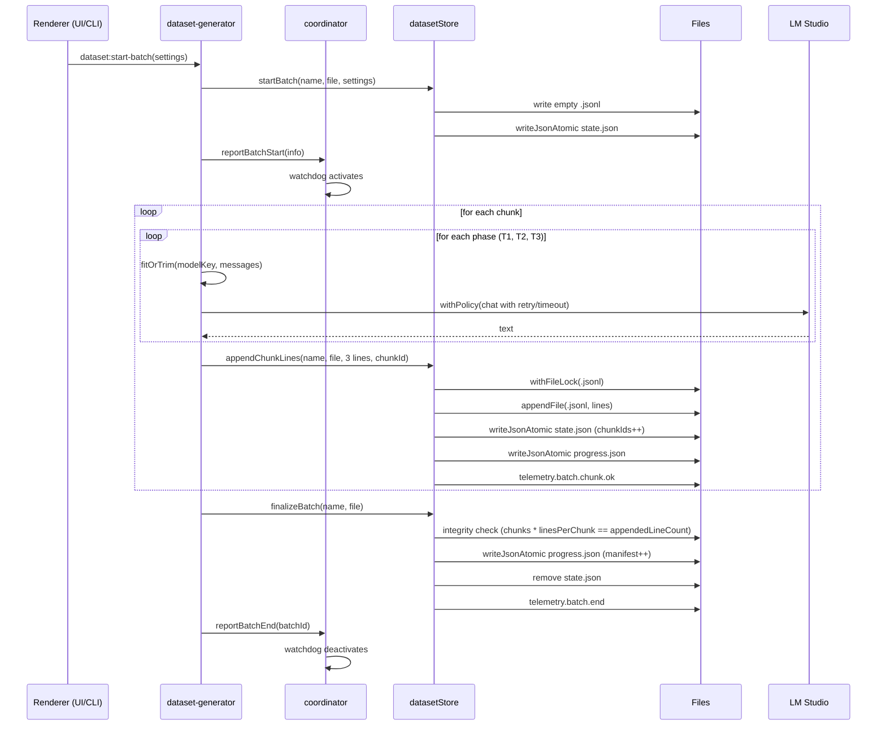

# Bibliary Resilience Layer (Phase 2.5R)

> Единая платформа отказоустойчивости для всех длительных LLM-пайплайнов в проекте: dataset
> generator (T1/T2/T3), будущий concept extraction (Phase 2), любые новые batch jobs.

## Содержание

1. [Зачем это нужно](#зачем-это-нужно)
2. [Архитектура](#архитектура)
3. [Модули и их API](#модули-и-их-api)
4. [Поток данных при batch generation](#поток-данных-при-batch-generation)
5. [Resume / Cancel / Discard семантика](#resume--cancel--discard-семантика)
6. [Watchdog и graceful shutdown](#watchdog-и-graceful-shutdown)
7. [Token Economy](#token-economy)
8. [Telemetry](#telemetry)
9. [Bootstrap и конфигурация](#bootstrap-и-конфигурация)
10. [Тестирование](#тестирование)
11. [Регистрация нового pipeline](#регистрация-нового-pipeline)
12. [FAQ и known issues](#faq-и-known-issues)

---

## Зачем это нужно

Длинные batch-генерации к LM Studio проваливаются по типичным сценариям: модель зависает,
сервер падает, пользователь закрывает приложение, OneDrive локает файл, два процесса (UI + CLI)
пишут в одни и те же файлы. Без слоя resilience — каждый сбой = потеря 13 чанков из 15
(см. инцидент в плане проекта). Phase 2.5R — единый ответ на эти классы проблем.

**Гарантии:**

- Любой обрыв (kill -9, SIGKILL, power-off) — **0 потерянных чанков** (атомарная запись + per-chunk checkpoint).
- UI и CLI пишут одни и те же файлы **без race** (cross-process lockfile).
- При исчезновении LM Studio — батч **автоматически** ставится на pause, при возврате —
  auto-resume с последнего чанка.
- При закрытии приложения — in-flight чанк дожимается (3 секунды buffer) и только потом exit.

---

## Архитектура

```
┌─────────────────────────────────────────────────────────────────────┐
│                       electron/lib/resilience/                       │
│                                                                      │
│  atomic-write.ts ──┐                                                 │
│  file-lock.ts   ──┼──> checkpoint-store.ts<T>                        │
│  telemetry.ts  ──┘                                                   │
│                                                                      │
│  lm-request-policy.ts (withPolicy: timeout, retry, backoff)          │
│                                                                      │
│  batch-coordinator.ts (singleton: registerPipeline, listActive,      │
│                        pauseAll, resumeAll, flushAll, scanUnfinished)│
│                                                                      │
│  lmstudio-watchdog.ts (poll /v1/models, эмитит pause/resume через    │
│                        coordinator при offline/online)               │
│                                                                      │
│  bootstrap.ts (initResilienceLayer)                                  │
└─────────────────────────────────────────────────────────────────────┘
                              │
                              ▼
┌─────────────────────────────────────────────────────────────────────┐
│                          electron/lib/token/                         │
│  budget.ts (TokenBudgetManager)                                      │
│  gbnf-mechanicus.ts (JSON schema для structured output)              │
│  overflow-guard.ts (registerModelContext, fitOrTrim)                 │
└─────────────────────────────────────────────────────────────────────┘
                              │
                              ▼
┌─────────────────────────────────────────────────────────────────────┐
│                          electron/lib/prompts/                       │
│  store.ts (FsPromptStore: data/prompts/{mechanicus.md,               │
│             mechanicus-grammar.json, dataset-roles.json})            │
└─────────────────────────────────────────────────────────────────────┘
                              │
                              ▼
┌─────────────────────────────────────────────────────────────────────┐
│                       Доменный слой (consumers)                      │
│                                                                      │
│  finetune-state.ts (registerDatasetPipeline, startBatch,             │
│                     appendChunkLines, finalizeBatch, discard)        │
│                                                                      │
│  dataset-generator.ts (PHASES loop, withPolicy, fitOrTrim,           │
│                        coordinator.reportBatchStart/End)             │
│                                                                      │
│  scripts/generate-batch.ts (CLI parity — тот же engine)              │
└─────────────────────────────────────────────────────────────────────┘
```

---

## Модули и их API

### `atomic-write.ts`

```ts
writeJsonAtomic(filePath: string, value: unknown): Promise<void>
writeTextAtomic(filePath: string, content: string): Promise<void>
```

Запись через `tmp + rename`. На POSIX rename атомарен; на NTFS ReplaceFile — практически.
При SIGKILL/power-off файл либо старый, либо новый — никогда не повреждённый JSON.

### `file-lock.ts`

```ts
withFileLock<T>(filePath: string, fn: () => Promise<T>, opts?: { retries?: number; stale?: number }): Promise<T>
```

Cross-process exclusive lock через `proper-lockfile`. Defaults: `retries=5`, `stale=10000ms`
(deadlock-recovery если процесс завис).

### `checkpoint-store.ts`

```ts
createCheckpointStore<T>(opts: { dir: string; schema: ZodSchema<T> }): CheckpointStore<T>

interface CheckpointStore<T> {
  save(id: string, snapshot: T): Promise<void>;
  load(id: string): Promise<T | null>;
  list(): Promise<Array<{ id: string; lastSavedAt: string }>>;
  remove(id: string): Promise<void>;
  scan(): Promise<Array<{ id: string; snapshot: T }>>;
  getPath(id: string): string;
}
```

Generic typed snapshot store с Zod-валидацией при `load`. Каждый pipeline создаёт свой
store со своим типом T (например `DatasetBatchState` для dataset-generator).

### `lm-request-policy.ts`

```ts
withPolicy<T>(
  policy: RequestPolicy,
  externalSignal: AbortSignal,
  ctx: { expectedTokens: number; observedTps: number },
  attempt: (innerSignal: AbortSignal) => Promise<T>
): Promise<T>
```

Оборачивает один LLM-запрос: адаптивный timeout, retry с экспоненциальным backoff,
учёт user-cancel (не ретраит), `abortGraceMs=1500` после abort (LM Studio bug #1203).

### `telemetry.ts`

```ts
configureTelemetry({ filePath, maxBytes? }): void  // вызывается из bootstrap
logEvent<E extends TelemetryEvent>(event: TelemetryEventInput<E>): void
tail(n: number): Promise<TelemetryEvent[]>
flush(): Promise<void>
```

Append-only structured journal в `data/telemetry.jsonl`. Auto-rotation при > 50 МБ.
Поддерживаемые типы событий см. `TelemetryEvent` в [`telemetry.ts`](../electron/lib/resilience/telemetry.ts).

### `batch-coordinator.ts`

Singleton, единственная точка истины об активных и незавершённых batch-ах.

```ts
interface BatchCoordinator {
  // регистрация и lookup
  registerPipeline(handle: PipelineHandle): void;
  getPipeline(name: PipelineName): PipelineHandle | null;
  resolvePipelineByBatchId(batchId: string): PipelineHandle | null;

  // lifecycle (pipeline ОБЯЗАН вызывать)
  reportBatchStart(info: BatchInfo): void;
  reportBatchEnd(batchId: string): void;

  // queries
  scanUnfinished(): Promise<Array<{ pipeline; id; snapshot }>>;
  isAnyActive(): boolean;
  listActive(): BatchInfo[];

  // global ops
  pauseAll(reason: string): Promise<void>;
  resumeAll(): Promise<void>;
  flushAll(timeoutMs: number): Promise<{ ok: boolean; pending: string[] }>;

  // events
  onBatchStart(cb): () => void;
  onBatchEnd(cb): () => void;
}
```

### `lmstudio-watchdog.ts`

```ts
startWatchdog(windowGetter: () => BrowserWindow | null): void
stopWatchdog(): void
```

Подписывается на `coordinator.onBatchStart/End`. Health-poll стартует только при наличии
активного batch (избегаем 24/7 фонового трафика к LM Studio). При 3 подряд таймаутах →
`coordinator.pauseAll('lmstudio-offline')` + IPC event для UI.

---

## Поток данных при batch generation



**Гарантия integrity при krash:** `state.appendedLineCount === processedChunkIds.length × linesPerChunk`.
Если не совпадает (jsonl записан, state не успел) — `reconcileWithJsonl` восстанавливает state по jsonl
при следующем start.

---

## Resume / Cancel / Discard семантика

| Операция | Активный batch | state.json | .jsonl | progress.json | UI текст |
|---|---|---|---|---|---|
| `coordinator.pauseAll('offline')` | abort signal | сохраняется | сохраняется | сохраняется | «Ожидание LM Studio…» |
| `api.batch.cancel(id)` | abort signal | **сохраняется** | сохраняется | сохраняется | «Прервано — продолжу позже» |
| `api.batch.discard(id)` | abort signal | **удаляется** | **удаляется** | НЕ трогается | «Удалено» |
| `api.batch.resume(name)` | новый run | reused | append | дописывается | продолжается |
| `finalizeBatch` (success) | done | удаляется | сохраняется | manifest добавлен | «Готово» |

**Ключевая идея:** `cancel` оставляет state для последующего resume; `discard` удаляет
без следа. `progress.processed_chunk_ids` НЕ трогается при discard — записанные в нём
ID были корректно обработаны и просто будут переобработаны позже.

---

## Watchdog и graceful shutdown

### Watchdog state machine

```
idle ──reportBatchStart──> activating ──setInterval(5s)──> polling
                                                            │
                                                  3 fails ──┤
                                                            ▼
                                                    offline ──pauseAll──┐
                                                            │           │
                                                  online ───┘           │
                                                            ▼           │
                                                    online ──resumeAll──┘
                                                            │
                                          isAnyActive()=false
                                                            ▼
                                                    deactivating ──> idle
```

### Graceful shutdown (`before-quit` handler в main.ts)

```
before-quit fired
       │
   isAnyActive?
       │
       ├─NO──> abortAllBatches + disposeClient + return (sync exit)
       │
       └─YES─> event.preventDefault()
              isQuitting = true
              telemetry.shutdown.flush.start
              flushAll(SHUTDOWN_FLUSH_TIMEOUT_MS = 3000)
                   │
                   ├─ok=true──> telemetry.shutdown.flush.ok, exit(0)
                   ├─ok=false─> telemetry.shutdown.flush.timeout, exit(2)
                   └─throw────> telemetry.shutdown.flush.error, exit(3)
```

**Почему non-zero exit codes:** updater или crash-reporter может детектить «прошлый сеанс
завершился аварийно: timeout (2)» / «exception (3)» и предложить пользователю проверить
данные.

---

## Token Economy

Перед каждым `chat()` вызовом dataset-generator делает `fitOrTrim(modelKey, messages, maxCompletion)`:

1. Если `modelKey` зарегистрирован (через `registerModelContext` после `loadModel`) →
   проверяется `system + few_shot + user + max_completion ≤ context × 0.92`.
2. Если не помещается — пробует `trimFewShot` (отбрасывает EXAMPLE блоки по одному).
3. Если даже после trim не помещается → `ContextOverflowError` → chunk помечается failed.

### GBNF / structured output

`buildMechanicusResponseFormat()` создаёт OpenAI-совместимый `response_format` для guaranteed
JSON output (LM Studio 0.4.0+):

```ts
const fmt = buildMechanicusResponseFormat(grammar);
chat({ ..., response_format: fmt });  // НЕ реализовано в client сейчас, готово к Phase 2 extraction
```

Используется для concept extraction (Phase 2), НЕ для dataset T1/T2/T3 (там plain text).

### Thinking-модели

Для Qwen3.x / DeepSeek-R1: `chat()` детектит `content === ""` + `reasoning_content` +
`finish_reason === "length"` и выбрасывает понятную ошибку «max_tokens exhausted on
reasoning». Дефолтные `max_tokens` в `dataset-roles.json` подняты до 6144/4096/3072 для
T1/T2/T3 — этого хватает на reasoning + answer для Qwen3.6.

---

## Telemetry

`data/telemetry.jsonl` — единственный канал structured-логов:

| Событие | Когда |
|---|---|
| `batch.start` | `coordinator.reportBatchStart` |
| `batch.chunk.ok` | После успешного `appendChunkLines` |
| `batch.chunk.fail` | Per-chunk failure (не убивает batch) |
| `batch.end` | `finalizeBatch` succeed |
| `shutdown.flush.start/ok/timeout/error` | Цепочка in `before-quit` handler |
| `lmstudio.offline/online` | Watchdog state change |
| `lmstudio.throttle` | tps < critical threshold |
| `lmstudio.crash_detected` | liveness OK но генерация замерла |

Чтение в UI: `api.resilience.telemetryTail(N)` (зарегистрирован, готов для resilience-bar).

---

## Bootstrap и конфигурация

В `electron/main.ts`:

```ts
app.whenReady().then(async () => {
  await initResilienceLayer({
    dataDir: 'data',                                  // default
    defaultsDir: path.join(__dirname, '..', 'defaults'),  // bundled prompts
    telemetryMaxBytes: 50 * 1024 * 1024,              // default
  });
  registerDatasetPipeline();
  startWatchdog(() => mainWindow);
  registerIpcHandlers(() => mainWindow);
  createWindow();
});
```

Все константы (intervals, thresholds, timeouts) — в [`electron/lib/resilience/constants.ts`](../electron/lib/resilience/constants.ts).

---

## Тестирование

```bash
npx tsx scripts/test-platform.ts          # 12/12 — atomic, lock, checkpoint, telemetry
npx tsx scripts/test-token.ts             # 16/16 — budget, gbnf, overflow-guard
npx tsx scripts/test-resume-batch.ts      # 9/9  — startBatch, append, recovery, race, finalize
npx tsx scripts/test-graceful-shutdown.ts # 4/4  — flushAll ok/timeout/empty/telemetry
npx tsx scripts/test-watchdog.ts          # 5/5  — через mock LM Studio, ~35s
npx tsx scripts/test-roles-shape.ts [N]   # требует живой LM Studio с загруженной моделью
```

Acceptance gate Phase 2.5R: все 6 скриптов exit 0 + `npm run electron:compile` + `ReadLints` без ошибок.

---

## Регистрация нового pipeline

Чтобы добавить новый длительный pipeline (например Phase 2 extraction):

```ts
// electron/extraction/extraction-state.ts
import { createCheckpointStore, coordinator, type PipelineHandle } from "../lib/resilience";

const ExtractionStateSchema = z.object({ /* ... */ });
const extractionStore = createCheckpointStore({
  dir: "data/checkpoints/extraction/",
  schema: ExtractionStateSchema,
});

const extractionHandle: PipelineHandle = {
  name: "extraction",
  store: extractionStore as unknown as CheckpointStore<unknown>,
  pause: async (batchId) => { /* abort active generation */ },
  resume: async (batchId) => { /* re-enter loop from checkpoint */ },
  cancel: async (batchId) => { /* abort, keep state */ },
  discard: async (batchId) => { /* delete state + data */ },
  flushPending: async () => { /* await in-flight writes */ },
};

export function registerExtractionPipeline(): void {
  coordinator.registerPipeline(extractionHandle);
}
```

В loop:

```ts
coordinator.reportBatchStart({ batchId, pipeline: "extraction", startedAt, config });
try {
  for (const item of items) {
    if (signal.aborted) break;
    const result = await withPolicy(DEFAULT_POLICY, signal, ctx, async (sig) => chat({...}));
    await saveCheckpoint(batchId, result);
  }
} finally {
  coordinator.reportBatchEnd(batchId);  // ОБЯЗАТЕЛЬНО — иначе watchdog не остановится
}
```

---

## FAQ и known issues

### Почему `enable_thinking=false` не работает в LM Studio 0.4.12?

LM Studio v0.4.12 OpenAI-compat endpoint игнорирует `chat_template_kwargs.enable_thinking`,
`extra_body.chat_template_kwargs`, `/no_think` тег в промпте. Это известное ограничение —
для Qwen3.x thinking-моделей всегда включён. Workaround: повышенный `max_tokens` в дефолтных
roles (6144/4096/3072 для T1/T2/T3) — этого хватает на reasoning + answer.

### Почему `batch:resume` не возвращает старый `batchId`?

При resume создаётся новый внутренний `batchId` (UUID), но `batchName`/`batchFile` те же.
Это позволяет иметь два IPC-уровня (внутренний UUID для AbortController и внешний batchName
для пользователя).

### Что делать если `flushAll` всегда отдаёт timeout?

Проверь `data/telemetry.jsonl` на `shutdown.flush.error` — там будет конкретная ошибка
pipeline. Чаще всего это lock-conflict с другим процессом (например параллельный CLI).

### Безопасно ли удалять `data/prompts/dataset-roles.json`?

Да. При следующем `initResilienceLayer` промпт-стор скопирует дефолтные значения из
`electron/defaults/prompts/`. Используй `promptStore.resetToDefaults('dataset-roles')`
для программного reset.

### Можно ли запустить UI и CLI одновременно?

Технически — да (lockfile защитит файлы), но не рекомендуется: они будут конкурировать
за GPU LM Studio и пользователь будет видеть прогресс только в одном месте.

---

**Версия документации:** Phase 2.5R · соответствует commit-у с `electron/lib/resilience/`.
