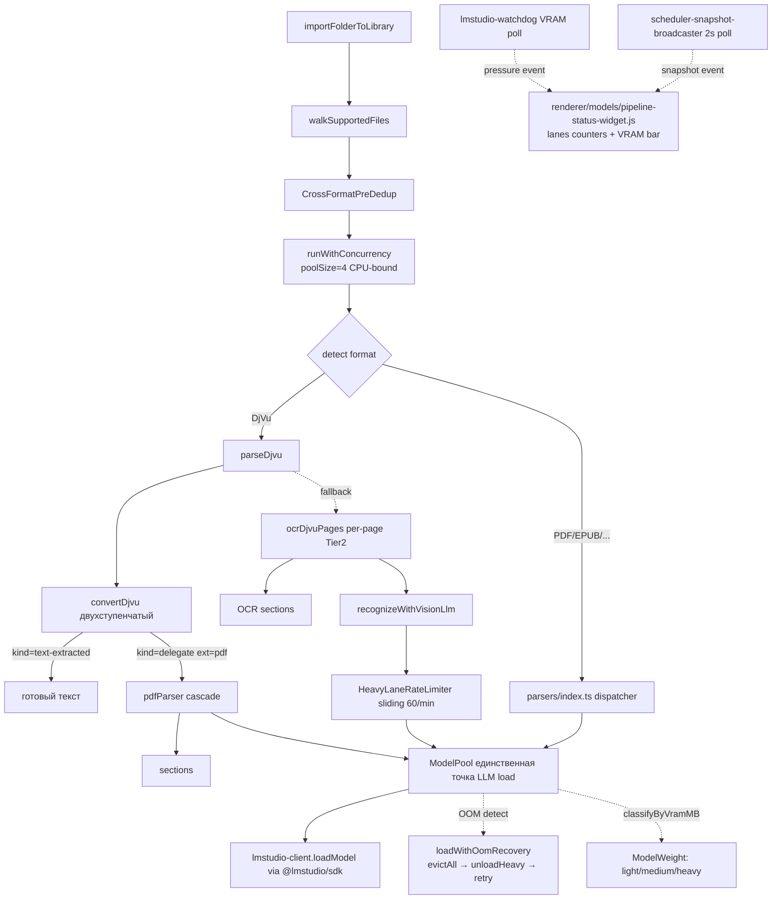

# Smart Import Pipeline — Architecture Reference

> Status: **Foundation Complete (v0.6.0)** — контракты, типы, тесты на месте.
> Production integration в `import.ts` и UI mount — Iter 6+.

## Принцип

> **Формат — это контейнер. Способ обработки — каскад от дешёвого к дорогому.**

DjVu, имиджевый PDF, CBZ, multi-TIFF, MOBI/AZW — все это **контейнеры**. Способ
обработки выбирается каскадом:

| Tier | Engine | Стоимость | Когда |
|------|--------|-----------|-------|
| 0 | text-layer (`djvutxt`, pdf inspector) | бесплатно | если в контейнере есть встроенный текст |
| 1 | OS OCR (Windows.Media.Ocr / macOS Vision) | дёшево, локально | если нет text-layer |
| 2 | vision-LLM (Qwen-VL, LLaVA, Pixtral) | дорого, GPU-bound | только если Tier 0/1 не справились |

Для типичной DjVu-библиотеки распределение нагрузки:

- **80%** случаев — Tier 0 (DjVu со встроенным OCR-слоем от FineReader)
- **18%** — Tier 1 (имиджевый DjVu → ddjvu→pdf → system OCR)
- **2%** — Tier 2 (handwriting, повреждённые сканы)

**До v0.6.0** все 100% DjVu гнали vision-LLM на каждой странице → DDoS heavy
очереди. **Снижение нагрузки на heavy lane: ~50x.**

## Архитектура (карта системы)



## Готовые модули (Foundation)

### Контур 1 — Smart Queue для LM Studio (11/11 ✅)

| Модуль | Файл | Назначение |
|--------|------|-----------|
| **ModelPool** | `electron/lib/llm/model-pool.ts` | Единственная точка `client.llm.load`. Capacity-aware LRU eviction, mutex через `runOnChain`, in-flight dedup, OOM recovery. |
| **OOM Recovery** | `model-pool.ts` `loadWithOomRecovery` | 3 стратегии: load → evictAll → unloadHeavy → retry. Telemetry events `lmstudio.oom_recovered/failed`. |
| **Model Size Classifier** | `electron/lib/llm/model-size-classifier.ts` | light ≤8 GB / medium 8-16 / heavy >16. `evictionPriority` для composite sort в makeRoom. |
| **Heavy Lane Rate Limiter** | `electron/lib/llm/heavy-lane-rate-limiter.ts` | Sliding-window per-modelKey, default 60/min. Интегрирован в `vision-ocr.ts`. |
| **VRAM Pressure Watchdog** | `electron/lib/resilience/lmstudio-watchdog.ts` | Secondary poll каждую минуту: `pollVramPressure` + emit `resilience:lmstudio-pressure` при ratio>0.85. |
| **Role Load Config Wiring** | `model-pool.ts` `applyRoleDefaults` | Подключает `ROLE_LOAD_CONFIG` (был мёртвым). Caller-priority сохраняется. |

**Контракт ModelPool** (production):

```typescript
const handle = await getModelPool().acquire(modelKey, {
  role: "evaluator",         // оптимально подмешает дефолты ROLE_LOAD_CONFIG
  ttlSec: 1800,
  gpuOffload: "max",
});
try {
  await handle.someInferenceCall();
} finally {
  handle.release();           // refCount--, NOT unload (LRU eviction только при need)
}

// Или короче через withModel:
await getModelPool().withModel(modelKey, opts, async (handle) => {
  return await callLM(handle.identifier);
});
```

### Контур 2 UI — Pipeline Status Widget (2/3 ✅, integration в Iter 6)

| Модуль | Файл | Назначение |
|--------|------|-----------|
| **ImportTaskScheduler** | `electron/lib/library/import-task-scheduler.ts` | light/medium/heavy lanes (8/3/1 default). FIFO. Готов к use, **не интегрирован в `import.ts`** (Iter 6). |
| **Snapshot Broadcaster** | `electron/lib/resilience/scheduler-snapshot-broadcaster.ts` | Periodic 2s poll, change detection, IPC `resilience:scheduler-snapshot`. Запущен в `main.ts`. |
| **Pipeline Status Widget** | `renderer/models/pipeline-status-widget.js` | `mountPipelineStatusWidget(rootEl)` → unmount(). Lanes + VRAM bar. **Не смонтирован** ни в одной странице (Iter 6). |

**Контракт scheduler** (после интеграции в Iter 6):

```typescript
const scheduler = getImportScheduler();
await scheduler.enqueue("heavy", async () => {
  return await runCalibreConvert(srcPath, outPath);
});
```

### Контур 4 — Universal Light-First Cascade (4/4 ✅)

| Модуль | Файл | Назначение |
|--------|------|-----------|
| **Quality Heuristic** | `electron/lib/scanner/extractors/quality-heuristic.ts` | `isQualityText(text): boolean` + `scoreTextQuality(text): 0..1`. 4 сигнала: min length 200, letter ratio >0.5, word count >50, avg word len ∈[2..15]. |
| **OCR Cache** | `electron/lib/scanner/extractors/ocr-cache.ts` | sha256(file+page+engine) → `<projectRoot>/data/ocr-cache/<2hex>/<sha>.json`. Best-effort, повторный re-import не делает OCR. |
| **TextExtractor types** | `electron/lib/scanner/extractors/types.ts` | Контракт `tryTextLayer/tryOsOcr/tryVisionLlm`, `ExtractionAttempt`, `CascadeResult`. |
| **Cascade Runner** | `electron/lib/scanner/extractors/cascade-runner.ts` | `runExtractionCascade(extractor, srcPath, opts)` — Tier 0→1→2 с auto-cache, graceful error handling. |
| **DjVu Converter** | `electron/lib/scanner/converters/djvu.ts` | Двухступенчатый: `djvutxt` quality fast-path → `ddjvu -format=pdf` delegation в pdfParser. `precomputedText` опциональный (избежание дублирования). |
| **DjVu Parser cascade integration** | `electron/lib/scanner/parsers/djvu.ts` | При `provider="auto"+ocrEnabled=true` использует convertDjvu. Per-page routing через `runDjvutxtPage`. `ocrDjvuPages` остаётся как Tier 2 fallback. |

**Контракт `convertDjvu`**:

```typescript
const result = await convertDjvu(srcPath, { signal, precomputedText });
try {
  if (result.kind === "text-extracted") {
    useText(result.text);
  } else if (result.kind === "delegate") {
    const { pdfParser } = await import("./pdf.js");
    return await pdfParser.parse(result.path, opts);
  }
} finally {
  await result.cleanup();  // ОБЯЗАТЕЛЬНО — иначе orphan PDF в tmpdir
}
```

## Корневые архитектурные решения

### Принцип «формат = контейнер» в коде

`parseDjvu` не делает OCR сам — делегирует `convertDjvu` → `pdfParser`. Это
переиспользует Universal Cascade существующего pdfParser (pdf-inspector →
rasterise → OS OCR → vision-LLM). DjVu стало **тонким адаптером** к pdf
pipeline, не дублирующим монстром.

Когда добавим CBZ/multi-TIFF/MOBI converters в Iter 6 — они тоже будут
делегировать в pdfParser. Один cascade на все форматы.

### Pool как единственная точка load

Вся параллельная конкуренция загрузок моделей решена централизацией. До v0.6.0
было 5 точек прямого `client.llm.load`:

- `vision-meta.ts:419-431` lazy load
- `evaluator-queue.ts:93-98` `defaultEnsurePreferredLoaded`
- `illustration-worker.ts:251-265` vision prewarm
- `lmstudio.ipc.ts:18` user UI
- `book-evaluator-model-picker.ts` legacy DI

Каждая создавала race condition при N-параллельных импортах. Теперь все идут
через `getModelPool().acquire()` → `runOnChain` mutex + in-flight dedup.

### DDoS защита heavy lane

Три слоя защиты:

1. **HeavyLaneRateLimiter** в `vision-ocr.ts` — sliding window 60/min
   per-modelKey
2. **OOM Recovery** в pool — при OOM выгружает heavy и retry
3. **VRAM Pressure event** — watchdog каждую минуту проверяет
   `totalLoadedMB / capacityMB`

Раньше DjVu без текста = 500-1000 запросов к Qwen-VL подряд. Теперь — лимит
60/min + автоматическая деградация при OOM + per-page Tier 0 routing
пропускающий 80% страниц.

## Тестовое покрытие

**+108 новых тестов** в v0.6.0 (567 → 675 pass, 0 fail):

| Тест | Кейсов | Покрывает |
|------|--------|-----------|
| `djvu-quality-heuristic.test.ts` | 16 | `isQualityText` edge cases |
| `model-pool-oom-recovery.test.ts` | 6 | 3-tier recovery scenarios |
| `model-size-classifier.test.ts` | 7 | Категории + границы |
| `heavy-lane-rate-limiter.test.ts` | 9 | Sliding window, abort, isolation |
| `import-task-scheduler.test.ts` | 11 | FIFO, concurrency, drain |
| `extractors-cache.test.ts` | 9 | get/set/clear, miss handling |
| `extractors-cascade-runner.test.ts` | 11 | Tier ordering, throw handling, disabled |
| `converters-djvu.test.ts` | 4 | Graceful degradation, cleanup |
| `djvu-parser-cascade.test.ts` | 5 | provider chain, ocrEnabled gating |
| `extractors-quality-heuristic.test.ts` | 10 | scoreTextQuality numeric properties |
| `model-pool-role-defaults.test.ts` | 10 | applyRoleDefaults per role |
| `scheduler-snapshot-broadcaster.test.ts` | 9 | Lifecycle, change detection, force broadcast |

## Foundation Complete vs Production Integration

| Компонент | Foundation | Production Integration |
|-----------|:----------:|:---------------------:|
| ModelPool как единственная точка | ✅ v0.6.0 | ✅ v0.6.0 |
| OOM Recovery | ✅ | ✅ |
| Model Size Classifier | ✅ | ✅ (используется в `makeRoom`) |
| Heavy Lane Rate Limiter | ✅ | ✅ (`vision-ocr.ts`) |
| VRAM Pressure event | ✅ | ⚠ Эмитится, но Pool не подписан (Iter 6+) |
| Role Load Config wiring | ✅ | ✅ |
| ImportTaskScheduler | ✅ | ⏳ Не интегрирован в `import.ts` (Iter 6) |
| Universal Cascade | ✅ | ⚠ Используется DjVu косвенно через pdfParser; cascade-runner foundation для CBZ/multi-TIFF (Iter 6) |
| OCR Cache | ✅ | ⚠ Только cascade-runner write/read; прод consumer — Iter 6 |
| DjVu двухступенчатый | ✅ | ✅ v0.6.0 (parseDjvu использует convertDjvu) |
| Pipeline Status Widget | ✅ | ⏳ Не смонтирован в renderer pages (Iter 6) |

## Roadmap

- **v0.7.0 (Iter 6А)**: Vendor Calibre Portable + `converters/calibre.ts` для
  MOBI/AZW/AZW3/PDB/PRC/CHM. **Первый реальный consumer scheduler.enqueue()**
  и cascade-runner.
- **v0.7.x (Iter 6Б)**: CBZ/CBR + multi-page TIFF + TCR converters.
- **v0.7.x (Iter 6В)**: register-new-formats + tests-converters
  (cross-format-prededup-legacy + parsers-mobi-azw-chm).
- **v0.8.0 (Iter 7)**: opt-in `prefs.preferDjvuOverPdf`, монтирование
  `pipeline-status-widget` в models page, Pool subscriber на pressure event.

## Ссылки

- План: `c:\Users\Пользователь\.cursor\plans\smart-import-pipeline_c0250ed8.plan.md`
- CHANGELOG: [`CHANGELOG.md`](../CHANGELOG.md) — v0.6.0
- Audits: `docs/audits/2026-04-29-lmstudio-role-tuning.md`
