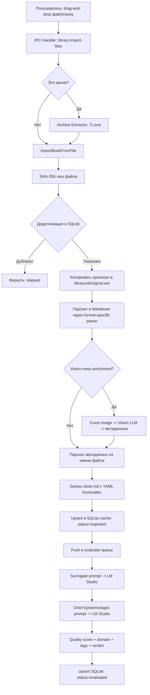
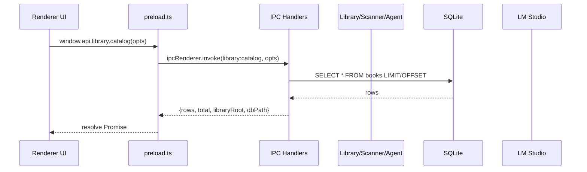
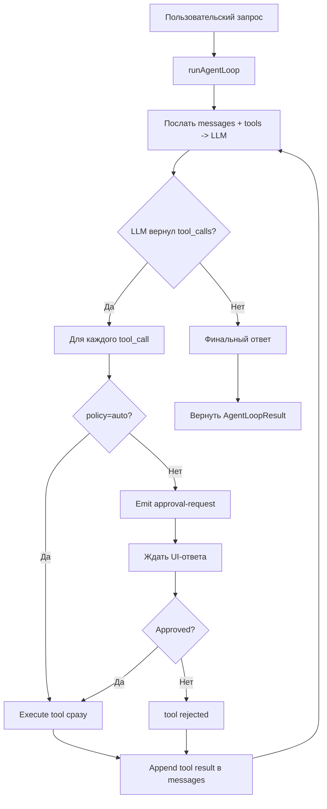
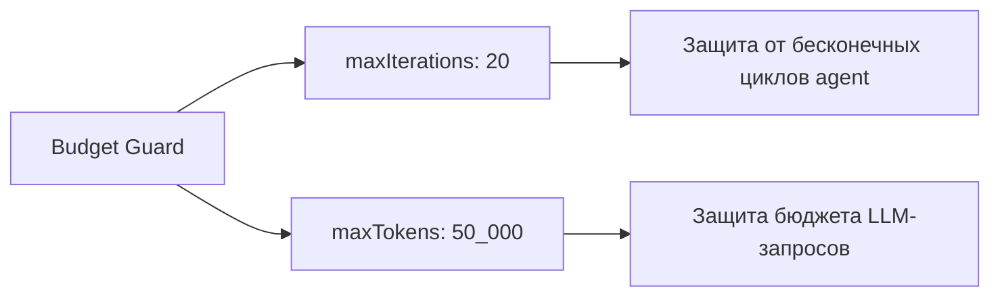
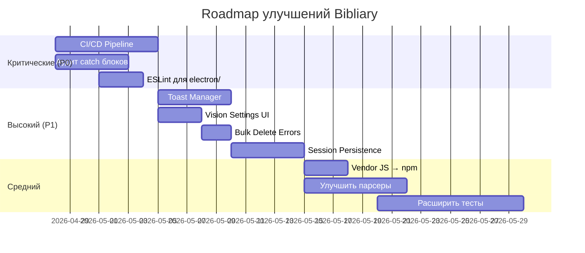

# Детальный анализ AI-AUDIT.md — Bibliary v3.3.1

> **Дата анализа:** 2026-04-27  
> **Объект:** `docs/AI-AUDIT.md` + ключевые файлы проекта  
> **Цель:** Структурированный разбор архитектуры, выявление проблем, обоснованные рекомендации

---

## ЧАСТЬ 1: ОСНОВНЫЕ КОМПОНЕНТЫ СИСТЕМЫ

### 1.1. Electron Main Process (ядро приложения)

| Компонент | Файл | Назначение |
|-----------|------|------------|
| Entry Point | [`main.ts`](electron/main.ts:1) | Инициализация приложения, CSP, протокол `bibliary-asset:`, управление окном |
| Preload Bridge | [`preload.ts`](electron/preload.ts:1) | `contextBridge` — 804 строки типов и экспозиции IPC-каналов для рендерера |
| IPC Handlers | [`electron/ipc/`](electron/ipc/) | 16 модулей-обработчиков: library, scanner, agent, lmstudio, dataset-v2, forge, qdrant, yarn, bookhunter, wsl, system, validators |
| LM Studio Client | [`lmstudio-client.ts`](electron/lmstudio-client.ts:1) | REST + SDK обёртка над локальным LLM-сервером |

### 1.2. Library Subsystem (библиотека)

| Компонент | Файл | Назначение |
|-----------|------|------------|
| Import Orchestrator | [`import.ts`](electron/lib/library/import.ts:1) | Координация импорта: SHA-256 дедупликация, архивы, parser pool |
| Book Import | [`import-book.ts`](electron/lib/library/import-book.ts:1) | Импорт одной книги: парсинг → Markdown → SQLite upsert |
| Cache DB | [`cache-db.ts`](electron/lib/library/cache-db.ts:1) | SQLite-кэш метаданных (barrel re-export 6 подмодулей) |
| Book Evaluator | [`book-evaluator.ts`](electron/lib/library/book-evaluator.ts:1) | LLM-оценка качества: Chief Epistemologist prompt |
| Evaluator Queue | [`evaluator-queue.ts`](electron/lib/library/evaluator-queue.ts:1) | Очередь задач эвалюации с параллельными слотами (default=2) |
| Surrogate Builder | [`surrogate-builder.ts`](electron/lib/library/surrogate-builder.ts:1) | Генерация суррогатного текста для эвалюации |
| Archive Extractor | [`archive-extractor.ts`](electron/lib/library/archive-extractor.ts:1) | ZIP/RAR/7z извлечение через bundled 7z.exe |
| File Walker | [`file-walker.ts`](electron/lib/library/file-walker.ts:1) | Рекурсивный обход FS с фильтрацией по расширениям |

### 1.3. Scanner/Parser Subsystem (парсинг документов)

| Формат | Файл | Технология |
|--------|------|------------|
| PDF | [`pdf.ts`](electron/lib/scanner/parsers/pdf.ts:1) | pdfjs-dist + опциональный OCR |
| EPUB | [`epub.ts`](electron/lib/scanner/parsers/epub.ts:1) | fast-xml-parser + jszip |
| FB2 | [`fb2.ts`](electron/lib/scanner/parsers/fb2.ts:1) | fast-xml-parser + бинарные изображения |
| DJVU | [`djvu.ts`](electron/lib/scanner/parsers/djvu.ts:1) | ddjvu CLI + OCR |
| DOCX | [`docx.ts`](electron/lib/scanner/parsers/docx.ts:1) | mammoth |
| RTF/ODT/HTML/TXT | [`rtf.ts`](electron/lib/scanner/parsers/rtf.ts:1), [`odt.ts`](electron/lib/scanner/parsers/odt.ts:1), [`html.ts`](electron/lib/scanner/parsers/html.ts:1), [`txt.ts`](electron/lib/scanner/parsers/txt.ts:1) | Regex/zip parsers |

### 1.4. AI Agent Subsystem

| Компонент | Файл | Назначение |
|-----------|------|------------|
| ReAct Loop | [`loop.ts`](electron/lib/agent/loop.ts:1) | Цикл agent: LLM → tool_calls → execute → результат |
| Tools Registry | [`tools.ts`](electron/lib/agent/tools.ts:1) | 9+ инструментов: search_help, recall_memory, Qdrant, BookHunter |
| History Sanitize | [`history-sanitize.ts`](electron/lib/agent/history-sanitize.ts:1) | Очистка истории сообщений для token budget |
| Types | [`types.ts`](electron/lib/agent/types.ts:1) | AgentBudget, AgentEvent, AgentMessage, ToolCall |

### 1.5. Resilience Layer (отказоустойчивость)

| Компонент | Файл | Назначение |
|-----------|------|------------|
| Bootstrap | [`bootstrap.ts`](electron/lib/resilience/bootstrap.ts:1) | Инициализация resilience-слоя |
| Batch Coordinator | [`batch-coordinator.ts`](electron/lib/resilience/batch-coordinator.ts:1) | Координация пакетных операций |
| Checkpoint Store | [`checkpoint-store.ts`](electron/lib/resilience/checkpoint-store.ts:1) | Сохранение/восстановление состояния |
| File Lock | [`file-lock.ts`](electron/lib/resilience/file-lock.ts:1) | Кросс-процессная блокировка файлов |
| Atomic Write | [`atomic-write.ts`](electron/lib/resilience/atomic-write.ts:1) | Атомарная запись файлов |
| LM Studio Watchdog | [`lmstudio-watchdog.ts`](electron/lib/resilience/lmstudio-watchdog.ts:1) | Мониторинг доступности LM Studio |
| Telemetry | [`telemetry.ts`](electron/lib/resilience/telemetry.ts:1) | Структурированное логирование событий |

### 1.6. Renderer Process (UI)

| Компонент | Файл | Назначение |
|-----------|------|------------|
| Router | [`router.js`](renderer/router.js:1) | Клиентский роутинг: 9 маршрутов (chat, library, qdrant, agent, crystal, models, forge, docs, settings) |
| Library | [`library/`](renderer/library/) | Каталог, импорт, reader, tag cloud, evaluator |
| Chat | [`chat.js`](renderer/chat.js:1) | RAG-чат с LM Studio |
| Forge | [`forge.js`](renderer/forge.js:1) | Fine-tuning wizard |
| Dataset V2 | [`dataset-v2.js`](renderer/dataset-v2.js:1) | Crystallizer / Dataset factory |
| i18n | [`i18n.js`](renderer/i18n.js:1) | Интернационализация (RU/EN, 1800+ ключей) |
| DOM Helpers | [`dom.js`](renderer/dom.js:1) | `el()`, `clear()` — утилиты манипуляции DOM |

### 1.7. Дополнительные подсистемы

| Подсистема | Описание |
|------------|----------|
| **YaRN** | Context expansion engine — расширение контекста для LLM |
| **BookHunter** | Поиск книг: Gutenberg, arXiv, OpenLibrary, Archive.org |
| **Forge** | Pipeline генерации сайтов/приложений |
| **Crystallizer** | Синтез тренировочных данных (dataset-v2) |
| **Qdrant** | Векторная БД для RAG-поиска |

---

## ЧАСТЬ 2: ВНУТРЕННЯЯ ЛОГИКА И СТРУКТУРА

### 2.1. Поток импорта книги (Data Flow)



### 2.2. Архитектура IPC (Inter-Process Communication)



### 2.3. ReAct Agent Loop



### 2.4. Хранение данных (File-System-First)

```
data/
├── library/
│   └── {uuid}/
│       ├── original.pdf          # Прistine копия источника
│       └── book.md               # Markdown + YAML frontmatter
├── bibliary-cache.db             # SQLite metadata cache
├── preferences.json              # 55 ключей настроек
└── telemetry.jsonl               # Структурированный event log
```

**Ключевой принцип:** книги хранятся как обычные файлы на ФС, а не в BLOB-полях БД. SQLite — только кэш метаданных для быстрого поиска и фильтрации.

### 2.5. Token Budget Management



---

## ЧАСТЬ 3: СИЛЬНЫЕ СТОРОНЫ

### 3.1. Архитектурные преимущества

| # | Сильная сторона | Обоснование |
|---|-----------------|-------------|
| 1 | **File-System-First** | Книги как файлы (`book.md` + `original.*`) выживают при потере SQLite. Нет vendor lock-in. Ручной просмотр возможен без приложения. |
| 2 | **Полностью оффлайн** | LM Studio + ONNX embeddings + SQLite — ноль облачных зависимостей. Конфиденциальность данных гарантирована архитектурно. |
| 3 | **Robust parsing pipeline** | 11 форматов парсеров с fallback-цепочками OCR. Vision-meta multi-model fallback — если одна модель не извлекла title/author, пробует следующую. |
| 4 | **Resilience layer** | Checkpoint store, batch coordinator, file locks, atomic writes, telemetry, graceful shutdown — промышленный уровень надёжности. |
| 5 | **CSP (Content Security Policy)** | Строгая CSP в [`main.ts:70`](electron/main.ts:70) защищает от XSS через Markdown payload, PDF text, HF model descriptions. |
| 6 | **Декомпозиция IPC** | Каждый домен в отдельном файле `ipc/{domain}.ipc.ts` с функцией `register{Domain}Handlers()`. Чёткие границы ответственности. |
| 7 | **ReAct agent с approval gate** | Деструктивные операции (ingest, delete, write_role) требуют одобрения пользователя. Защита от галлюцинаций LLM. |
| 8 | **Streaming ingest** | Async generator scanner + parser pool (`cpus-1`) + per-file timeout 8 мин. Прогресс течёт с первого файла, не ждёт окончания сканирования. |
| 9 | **Bilingual UI** | 1800+ i18n-ключей, RU/EN, с защитой от потери прогресса при смене языка (`canRemount` guard в [`router.js:43`](renderer/router.js:43)). |
| 10 | **Portable build** | Один `.exe` с data-директорией рядом. Нет установки, нет системных зависимостей. |

### 3.2. Качество кода

| # | Наблюдение | Обоснование |
|---|------------|-------------|
| 1 | **TypeScript strict mode** | Main process полностью на TS с `"type": "module"`. Строгая типизация на уровне компилятора. |
| 2 | **JSDoc @ts-check в рендерере** | Vanilla JS с типами через JSDoc — компромисс между скоростью разработки и безопасностью типов. |
| 3 | **Zod для валидации IPC** | [`validators.ts`](electron/ipc/validators.ts:1) — schema-first валидация входящих данных IPC. |
| 4 | **AbortSignal propagation** | Поддержка отмены операций через `AbortSignal` в импорте, agent loop, dataset synthesis. |
| 5 | **Тестовое покрытие** | ~153 тест-кейсов в 21 файле + smoke E2E + 12+ live E2E скриптов. |

---

## ЧАСТЬ 4: СЛАБЫЕ СТОРОНЫ И ТЕХНИЧЕСКИЙ ДОЛГ

### 4.1. Критические проблемы (P0)

| # | Проблема | Файл | Риск | Обоснование |
|---|----------|------|------|-------------|
| 1 | **Отсутствие CI/CD** | `.github/workflows/` пуста | Высокий | Все проверки ручные. Нет автоматической валидации PR. Риск регрессии при каждом коммите. |
| 2 | **74 пустых `catch {}` блока** | Весь код | Средний | Большинство — intentional fallback, но без комментария `// intentional: ...` невозможно отличить от забытого error handling. |
| 3 | **ESLint только для renderer** | `package.json:45` | Средний | `electron/` полагается только на TS strict mode. Нет линтинга на code style, потенциальные bugs без статического анализа. |

### 4.2. Проблемы качества и UX (P1)

| # | Проблема | Файл | Влияние | Обоснование |
|---|----------|------|---------|-------------|
| 1 | **Vision settings не в UI** | [`sections.js`](renderer/settings/sections.js:1) | Пользователь не может управлять `visionModelKey`/`visionMetaEnabled` через интерфейс. Только через `preferences.json`. |
| 2 | **Bulk delete — молчаливые ошибки** | [`catalog.js`](renderer/library/catalog.js:1) | Частичные сбои при удалении → `console.warn`. Пользователь не видит, какие книги не удалились. |
| 3 | **Session persistence не реализована** | — | Потеря выбора книг при перезапуске. Нет сохранения состояния UI между сессиями. |
| 4 | **Нет centralized toast manager** | `renderer/components/` | Разношёрстные уведомления: `showAlert` / status label / inline toast. Нет единой системы уведомлений. |
| 5 | **RTF/DOC/ODT парсеры хрупкие** | `electron/lib/scanner/parsers/` | Сложные файлы часто дают пустые sections. Regex-парсеры не справляются с реальными документами. |

### 4.3. Проблемы инфраструктуры

| # | Проблема | Влияние | Обоснование |
|---|----------|---------|-------------|
| 1 | **Vendor JS в репозитории** | `marked.umd.js`, `purify.min.js` лежат в `renderer/` вместо npm-зависимостей. Увеличивает размер репозитория, усложняет обновления. |
| 2 | **`marked` duplication** | npm-пакет `marked` может быть избыточным — рендерер использует `marked.umd.js` через `<script>` tag. |
| 3 | **Native module rebuild** | `better-sqlite3`, `@napi-rs/canvas`, `@napi-rs/system-ocr`, `sharp` требуют rebuild для Electron ABI. Хрупкий процесс установки. |
| 4 | **Windows-first, но без CI** | Проект таргетит Windows, но нет автоматических build-тестов. Portable build может сломаться без заметных признаков. |
| 5 | **Не покрыто тестами** | Forge wizard, BookHunter, Agent, DJVU parser, YaRN engine, resilience/watchdog — 0 тестов. |

### 4.4. Архитектурные компромиссы

| # | Компромисс | Обоснование |
|---|------------|-------------|
| 1 | **Vanilla JS в рендерере** | Плюс: ноль зависимостей, полный контроль. Минус: нет реактивности, manual DOM updates, сложнее поддерживать при росте UI. |
| 2 | **SQLite как кэш, не как источник правды** | Плюс: устойчивость к потере БД. Минус: eventual consistency между ФС и БД, сложнее delta-sync. |
| 3 | **Sequential archive processing для drag&drop** | Обосновано: единичные файлы, параллелизм даёт малый выигрыш. Но при большом архиве UI может зависнуть. |
| 4 | **`DEFAULT_SLOT_COUNT=2` в evaluator-queue** | Параллельные LLM-запросы могут менять порядок оценки книг. Тесты должны явно вызывать `setEvaluatorSlots(1)`. |

---

## ЧАСТЬ 5: РЕКОМЕНДАЦИИ ПО УЛУЧШЕНИЮ

### 5.1. Критические (немедленная реализация)

#### R1: Внедрить CI/CD pipeline

**Приоритет:** P0  
**Обоснование:** Без автоматических проверок каждый коммит — риск регрессии.

```yaml
# .github/workflows/ci.yml (рекомендуемая структура)
name: CI
on: [push, pull_request]
jobs:
  test:
    runs-on: windows-latest
    steps:
      - uses: actions/checkout@v4
      - uses: actions/setup-node@v4
        with: { node-version: 22 }
      - run: npm ci
      - run: npm run lint
      - run: npm run test:fast
      - run: npm run electron:compile
```

**Действия:**
1. Создать `.github/workflows/ci.yml` с шагами: `npm ci` → `tsc --noEmit` → `eslint` → `npm test`
2. Добавить build-матрицу для portable + NSIS
3. Настроить artifact upload для бинарников

#### R2: Аудит пустых `catch {}` блоков

**Приоритет:** P0  
**Обоснование:** 74 пустых блока — потенциальные скрытые ошибки.

**Действия:**
1. Запустить `grep -r "catch\s*{}\|catch\s*{\s*}" electron/ renderer/` для инвентаризации
2. Для каждого блока решить:
   - Если intentional fallback → добавить комментарий `// intentional: <reason>`
   - Если забытый error handling → добавить `console.warn()` с контекстом
3. Добавить ESLint rule `no-empty-catch` с исключением для закомментированных блоков

#### R3: Расширить ESLint на `electron/`

**Приоритет:** P0  
**Обоснование:** TypeScript strict mode не заменяет линтинг. Пропускаются: unused variables, complexity, potential bugs.

**Действия:**
1. Добавить `@typescript-eslint` в `eslint.config.js`
2. Настроить правила для `electron/**/*.ts`
3. Обновить `npm run lint`:
   ```json
   "lint": "tsc --noEmit && eslint \"renderer/**/*.js\" \"electron/**/*.ts\" --max-warnings=0"
   ```

### 5.2. Высокий приоритет

#### R4: Centralized Toast Manager

**Приоритет:** P1  
**Обоснование:** Разношёрстные уведомления ухудшают UX. Пользователь не понимает статус операций.

**Действия:**
1. Создать `renderer/components/toast-manager.js` с API:
   ```js
   toast.success(msg)  // зелёный тост
   toast.error(msg)    // красный тост
   toast.warn(msg)     // жёлтый тост
   toast.info(msg)     // синий тост
   ```
2. Заменить все `showAlert()` / `console.warn()` в UI-коде на `toast.*`
3. Добавить queue для одновременных уведомлений (max 3 видимых)

#### R5: Vision Settings в UI

**Приоритет:** P1  
**Обоснование:** Критическая настройка недоступна пользователю.

**Действия:**
1. Добавить секцию в `renderer/settings/sections.js`:
   - Toggle: `visionMetaEnabled` (вкл/выкл)
   - Select: `visionModelKey` (выбор модели из доступных vision-моделей)
   - Number: `visionMetaModelAttempts` (max fallback attempts)
2. Связать с `data/preferences.json` через `window.api.system.*`

#### R6: Bulk Delete Error Reporting

**Приоритет:** P1  
**Обоснование:** Молчаливые частичные сбои → потеря данных без уведомления.

**Действия:**
1. В `renderer/library/catalog.js` собрать ошибки удаления в массив
2. После batch-удаления показать toast с детализацией:
   ```
   "Удалено: 15 книг. Ошибки: 2 (книга_A: permission denied, книга_B: file in use)"
   ```

#### R7: Session Persistence

**Приоритет:** P1  
**Обоснование:** Потеря состояния UI при перезапуске.

**Действия:**
1. Сохранять в `data/session.json`:
   - Активный маршрут
   - Выбранные книги в каталоге
   - Фильтры каталога
   - Последняя открытая книга в reader
2. Восстанавливать при запуске из `session.json`

### 5.3. Средний приоритет

#### R8: Мигрировать vendor JS в npm-зависимости

**Приоритет:** Средний  
**Обоснование:** `marked.umd.js` и `purify.min.js` в репозитории — технический долг.

**Действия:**
1. Удалить `renderer/marked.umd.js` и `renderer/vendor/purify.min.js`
2. Использовать npm-пакеты через ES module imports в рендерере
3. Убрать `<script>` tag из `index.html`

#### R9: Улучшить RTF/DOC/ODT парсеры

**Приоритет:** Средний  
**Обоснование:** Хрупкие regex-парсеры → пустые sections для сложных документов.

**Действия:**
1. Для DOC: рассмотреть `mammoth` (как для DOCX) или `docx2txt`
2. Для ODT: использовать `jszip` + парсинг `content.xml` (ODT = ZIP с XML внутри)
3. Для RTF: рассмотреть `rtf-parse` или добавить минимальный RTF tokenizer
4. Добавить fallback: если парсер вернул < 100 слов → пометить книгу `warnings: ["parser: low content yield"]`

#### R10: Расширить тестовое покрытие

**Приоритет:** Средний  
**Обоснование:** Критические подсистемы без тестов.

| Подсистема | Рекомендуемые тесты |
|------------|---------------------|
| Agent | Unit-тесты для tool parsing, budget guards, approval flow |
| Forge | Contract tests для pipeline steps |
| BookHunter | Mock-тесты для aggregator + downloader |
| Resilience | Unit-тесты для checkpoint store, file lock, atomic write |
| DJVU Parser | Integration test с фиктивным .djvu файлом |

### 5.4. Долгосрочные рекомендации

#### R11: Рассмотреть миграцию рендерера на фреймворк

**Приоритет:** Долгосрочный  
**Обоснование:** Vanilla JS с manual DOM updates становится сложным при росте UI.

**Варианты:**
| Фреймворк | Плюсы | Минусы |
|-----------|-------|--------|
| Preact | 3KB, React-compatible API | Нужно переписать DOM helpers |
| Svelte | Compile-time, ноль runtime overhead | Новый build step |
| Lit | Web Components, лёгкий | Меньшая экосистема |

**Рекомендация:** Preact — минимальный overhead, максимальная совместимость с существующим кодом.

#### R12: Добавить integration tests для IPC

**Приоритет:** Долгосрочный  
**Обоснование:** IPC contract — критический интерфейс между main и renderer. Нет автоматических contract tests.

**Действия:**
1. Создать `tests/ipc-contract.test.ts` с проверкой:
   - Каждый `ipcMain.handle()` в `electron/ipc/` имеет пару в `preload.ts`
   - Zod schema валидирует входящие args
   - Возвращаемые типы соответствуют JSDoc в `preload.ts`

#### R13: Добавить metrics dashboard

**Приоритет:** Долгосрочный  
**Обоснование:** `telemetry.jsonl` собирается, но нет UI для анализа.

**Действия:**
1. Создать `renderer/telemetry.js` с графиками:
   - Импорт книг: скорость, ошибки, форматы
   - Эвалюация: queue depth, avg latency, model usage
   - Agent: iterations, tokens used, tool success rate
2. Визуализация через lightweight charting (Chart.js или аналог)

---

## ЧАСТЬ 6: ИТОГОВАЯ ОЦЕНКА

### 6.1. Общая оценка зрелости проекта

| Критерий | Оценка | Комментарий |
|----------|--------|-------------|
| Архитектура | ⭐⭐⭐⭐☆ | Чёткая декомпозиция, file-system-first, resilience layer. Минус: нет CI/CD. |
| Код | ⭐⭐⭐⭐☆ | TS strict + JSDoc, Zod validation. Минус: 74 пустых catch, ESLint только для renderer. |
| Тесты | ⭐⭐⭐☆☆ | 153 unit-теста + smoke E2E. Минус: ключевые подсистемы не покрыты. |
| UX | ⭐⭐⭐☆☆ | Bilingual, drag-drop, busy-lock. Минус: нет toast manager, session persistence, vision settings. |
| Документация | ⭐⭐⭐⭐⭐ | AI-AUDIT.md — эталонный документ. 7+ docs файлов. |
| Безопасность | ⭐⭐⭐⭐☆ | Строгая CSP, file locks, atomic writes. Минус: нет CI для security audit. |

### 6.2. Roadmap приоритетов



### 6.3. Ключевые выводы

1. **Bibliary — зрелый проект с промышленной архитектурой.** File-system-first подход, resilience layer и строгая CSP демонстрируют глубокий инженерный опыт.

2. **Главная уязвимость — отсутствие CI/CD.** Без автоматических проверок проект растёт в режиме ручного QA, что не масштабируется.

3. **Технический долг управляем.** 74 пустых catch блока и хрупкие парсеры — известные проблемы с чёткими путями решения.

4. **UI требует унификации.** Centralized toast manager + session persistence + vision settings закроют основные UX-пробелы.

5. **Тестовое покрытие асимметрично.** Library import/evaluator хорошо покрыты, но Agent/Forge/BookHunter — слепые зоны.

---

*Анализ завершён. Документ готов к ревью и обсуждению приоритетов.*
