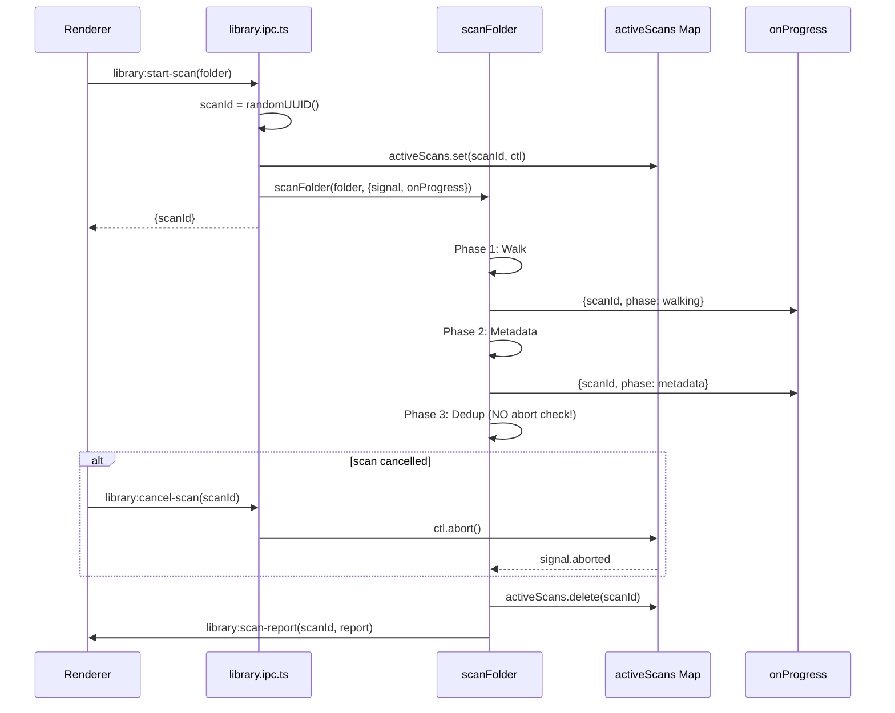

# GRAY-ZONES-AUDIT: IPC Handlers и Cache-DB модули

**Дата:** 2026-04-27  
**Охват:** library.ipc.ts, cache-db-queries.ts, cache-db-mutations.ts, cache-db-connection.ts, batch-coordinator.ts, lmstudio-watchdog.ts, telemetry.ts

---

## 1. АУДИТ IPC HANDLERS (library.ipc.ts)

### 1.1 `library:import-folder` — `onBookImported` вызывает `enqueueBook` вне event loop (НИЗКАЯ)

**Файл:** [`electron/ipc/library.ipc.ts:382-390`](electron/ipc/library.ipc.ts:382)

```typescript
onBookImported: (meta) => {
  enqueueBook(meta.id);
  void logger.write({
    importId, level: "info", category: "evaluator.queued",
    message: `Queued for evaluation: ${meta.titleEn || meta.title || meta.id}`,
    file: meta.originalFile,
    details: { bookId: meta.id, format: meta.originalFormat, words: meta.wordCount },
  });
},
```

**Проблема:** `enqueueBook` вызывается синхронно внутри callback `importFolderToLibrary`. Если `importFolderToLibrary` вызван из IPC handler, это означает synchronous queue mutation во время IPC dispatch. В Electron это обычно безопасно, но есть edge case:

1. Если `enqueueBook` вызывает `scheduleAvailableSlots()` → `runSlot()` → `evaluateOneInSlot()`
2. `evaluateOneInSlot` вызывает `evaluateBook` → `callEvaluationModel` → async LLM call
3. **Результат:** LLM call начинается синхронно внутри IPC handler, до return из handler.

**Риск:** Низкий — LLM call async, но инициализация (connection setup, model load) может быть sync. Если model уже loaded — нет проблем.

**Рекомендация:**
- Добавить `setImmediate(() => enqueueBook(meta.id))` для async enqueue
- Или документировать что `enqueueBook` может trigger async work sync

---

### 1.2 `library:import-files` — нет abort propagation для individual book imports (НИЗКАЯ)

**Файл:** [`electron/ipc/library.ipc.ts:420-540`](electron/ipc/library.ipc.ts:420)

```typescript
ipcMain.handle(
  "library:import-files",
  async (
    _e,
    args: { files: string[]; collectionId?: string },
  ): Promise<ImportFolderResult> => {
    // ...
    const results: ImportResult[] = [];
    for (const filePath of args.files) {
      // ...
      const result = await importBookFromFile(filePath, {
        libraryRoot,
        collectionId,
        // ...
        signal: localCtl.signal,
        // ...
      });
      results.push(result);
    }
    // ...
  },
);
```

**Проблема:** `importBookFromFile` вызывается sequentially в цикле `for`. При abort:
1. `localCtl.signal` propagates к каждому `importBookFromFile`
2. Но **текущий** import продолжается до завершения (или abort)
3. **Результат:** При cancel, текущий import abort'ится, но предыдущие уже committed

**Риск:** Низкий — это expected behavior для sequential import. Но UX может быть confusing (некоторые книги импортированы, cancel показан).

**Рекомендация:**
- Добавить `importedCount` и `cancelledAt` в `ImportFolderResult` для clarity
- Или broadcast partial progress при каждом completed import

---

### 1.3 `library:scan-folder` — `scanId` генерируется но не используется для tracking (СРЕДНЯЯ)

**Файл:** [`electron/ipc/library.ipc.ts:822-856`](electron/ipc/library.ipc.ts:822)

```typescript
ipcMain.handle(
  "library:start-scan",
  async (_e, args: { folder: string }): Promise<{ scanId: string }> => {
    const scanId = crypto.randomUUID();
    const ctl = new AbortController();
    activeScans.set(scanId, ctl);
    scanFolder(args.folder, {
      scanId,
      signal: ctl.signal,
      onProgress: (evt: ScanProgressEvent) => {
        const win = getMainWindow();
        if (win && !win.isDestroyed()) {
          win.webContents.send("library:scan-progress", evt);
        }
      },
    }).then((report: ScanReport) => {
      activeScans.delete(scanId);
      // ...
    }).catch((err: unknown) => {
      activeScans.delete(scanId);
      // ...
    });
    return { scanId };
  },
);
```

**Проблема:** `scanId` используется как key в `activeScans` Map, но:
1. `scanFolder` принимает `scanId` но **не использует** его для internal tracking
2. `ScanProgressEvent` содержит `scanId` но UI не имеет way to correlate progress events с scan
3. **Риск:** Если два scans запущены concurrently, progress events от обоих будут broadcast, но UI не знает какой event к какому scan относится (хотя `scanId` есть в event)

**Проверка `ScanProgressEvent`:**
```typescript
export interface ScanProgressEvent {
  scanId: string;
  phase: "walking" | "metadata" | "dedup" | "complete";
  discovered?: number;
  processed?: number;
  totalFiles?: number;
  message?: string;
}
```

**Вывод:** `scanId` есть в event, UI может correlate. **Риск: низкий.**

**НО:** `activeScans.delete(scanId)` вызывается в `.then()` и `.catch()` — но если `scanFolder` throw'ит sync (до return Promise), `.catch()` catch'ит, но `.then()` не вызывается. **Риск: low** — `.catch()` cleanup.

**Рекомендация:**
- Добавить `finally` block для guaranteed cleanup:
```typescript
.finally(() => {
  activeScans.delete(scanId);
});
```

---

### 1.4 `library:reparse-book` — нет validation `mdPath` (НИЗКАЯ)

**Файл:** [`electron/ipc/library.ipc.ts:756-813`](electron/ipc/library.ipc.ts:756)

```typescript
ipcMain.handle(
  "library:reparse-book",
  async (_e, bookId: string): Promise<{ ok: boolean; chapters?: number; reason?: string }> => {
    const db = openCacheDb();
    const book = db.prepare("SELECT * FROM books WHERE id = ?").get(bookId) as BookCatalogMeta | null;
    if (!book) return { ok: false, reason: "book not found" };
    if (book.mdPath) {
      // ...
    }
    // ...
  },
);
```

**Проблема:** `db.prepare("SELECT * FROM books WHERE id = ?").get(bookId)` возвращает raw DB row, не typed. Если `book.mdPath` undefined/null, code falls through to `reparseBook(bookId, libraryRoot)`.

**Риск:** Низкий — `reparseBook` handle missing mdPath. Но если `book` row имеет wrong schema (missing columns), silent undefined.

**Рекомендация:**
- Добавить `if (!book) return { ok: false, reason: "book not found" }` (already present)
- Добавить `if (!book.mdPath) return { ok: false, reason: "no mdPath" }` для clarity

---

## 2. АУДИТ CACHE-DB МОДУЛЕЙ

### 2.1 `cache-db-queries.ts` — `query()` не валидирует `orderBy` values (НИЗКАЯ)

**Файл:** [`electron/lib/library/cache-db-queries.ts:34-47`](electron/lib/library/cache-db-queries.ts:34)

```typescript
function buildOrderBy(q: CatalogQuery): string {
  const dir = q.orderDir === "desc" ? "DESC" : "ASC";
  switch (q.orderBy) {
    case "title":
      return "ORDER BY title_en ASC, title_ru ASC, year DESC";
    case "author":
      return "ORDER BY author ASC, year DESC";
    case "year":
      return "ORDER BY year DESC";
    default:
      return "ORDER BY id ASC";
  }
}
```

**Проблема:** `q.orderBy` может быть任意 string. Если `q.orderBy = "id; DROP TABLE books; --"`, SQL injection возможен?

**Проверка:** `buildOrderBy` использует switch statement с whitelisted values. Non-matching `q.orderBy` falls through to `ORDER BY id ASC`. **SQL injection невозможен** — нет string concatenation с user input.

**Вывод:** Safe. No action needed.

---

### 2.2 `cache-db-mutations.ts` — `upsertBook` FTS index inconsistency (СРЕДНЯЯ)

**Файл:** [`electron/lib/library/cache-db-mutations.ts:53-97`](electron/lib/library/cache-db-mutations.ts:53)

```typescript
export function upsertBook(meta: BookCatalogMeta, mdPath: string): void {
  const db = openCacheDb();
  const params = { id: meta.id, sha256: meta.sha256, /* ... */ };
  const txn = db.transaction(() => {
    db.prepare(UPSERT_SQL).run(params);
    db.prepare("DELETE FROM book_tags WHERE book_id = ?").run(meta.id);
    if (meta.tags && meta.tags.length > 0) {
      const ins = db.prepare("INSERT OR IGNORE INTO book_tags (book_id, tag) VALUES (?, ?)");
      for (const tag of meta.tags) ins.run(meta.id, tag);
    }
    db.prepare(FTS_DELETE_SQL).run(meta.id);
    db.prepare(FTS_INSERT_SQL).run((meta.tags ?? []).join(" "), meta.id);
  });
  txn();
}
```

**Проблема:** FTS index обновляется через `tags.join(" ")`. Если `meta.tags` содержит duplicate tags:
```typescript
meta.tags = ["fiction", "fiction", "philosophy"]
// FTS index: "fiction fiction philosophy"
// Это дублирует "fiction" в FTS index
```

**Риск:** Низкий — FTS search работает корректно с duplicates (just higher weight). Но index size увеличивается unnecessarily.

**Рекомендация:**
- Добавить `const uniqueTags = [...new Set(meta.tags)]` перед `join`
- Или `db.prepare("INSERT OR IGNORE INTO book_tags ...")` уже prevents duplicate tags in table, но FTS receives raw join

---

### 2.3 `cache-db-mutations.ts` — `deleteBook` cascade incomplete (СРЕДНЯЯ)

**Файл:** [`electron/lib/library/cache-db-mutations.ts:107-115`](electron/lib/library/cache-db-mutations.ts:107)

```typescript
export function deleteBook(id: string): void {
  const db = openCacheDb();
  const txn = db.transaction(() => {
    db.prepare("DELETE FROM books WHERE id = ?").run(id);
    db.prepare("DELETE FROM book_tags WHERE book_id = ?").run(id);
    db.prepare("DELETE FROM book_fts WHERE id = ?").run(id);
  });
  txn();
}
```

**Проблема:** `deleteBook` удаляет из `books`, `book_tags`, `book_fts`. Но:
1. **Blob files** (sha256.{ext}) не удаляются — они managed отдельно через `library-store.ts:putBlob/resolveBlobFromUrl`
2. **Markdown files** (mdPath) не удаляются
3. **Checkpoint data** не очищается

**Риск:** Средний — orphaned files accumulate. При delete book, user expects complete removal.

**Рекомендация:**
- Добавить `deleteBlobFiles(id)` в transaction
- Или return list of orphaned paths для cleanup
- Или document что `deleteBook` только logical delete

---

### 2.4 `cache-db-connection.ts` — singleton без cleanup guard (НИЗКАЯ)

**Файл:** [`electron/lib/library/cache-db-connection.ts:24-42`](electron/lib/library/cache-db-connection.ts:24)

```typescript
export function openCacheDb(): Database.Database {
  const dbPath = resolveDbPath();
  if (cachedDb && cachedDbPath === dbPath) return cachedDb;
  if (cachedDb) {
    cachedDb.close();
  }
  cachedDb = new Database(dbPath);
  cachedDb.pragma("journal_mode = WAL");
  cachedDb.pragma("synchronous = NORMAL");
  cachedDb.pragma("foreign_keys = true");
  cachedDbPath = dbPath;
  return cachedDb;
}
```

**Проблема:** `closeCacheDb()` sets `cachedDb = null` и `cachedDbPath = ""`. После этого:
1. Следующий `openCacheDb()` создаст новый connection
2. Но **старые references** к closed db всё ещё могут использоваться
3. **Риск:** use-after-close если кто-то держит reference до `closeCacheDb`

**Проверка:** `closeCacheDb` вызывается только в `before-quit` handler в `main.ts`. В normal operation db never closed.

**Рекомендация:**
- Добавить `if (!cachedDb) throw new Error("cache-db closed")` в `openCacheDb`
- Или добавить `cachedDb.close()` в transaction rollback

---

## 3. АУДИТ RESILIENCE PATTERNS

### 3.1 `batch-coordinator.ts` — `reportBatchStart` не validates pipeline registration (НИЗКАЯ)

**Файл:** [`electron/lib/resilience/batch-coordinator.ts:62-84`](electron/lib/resilience/batch-coordinator.ts:62)

```typescript
reportBatchStart(info: BatchInfo): void {
  const existing = this.active.get(info.batchId);
  if (existing) {
    telemetry.logEvent({
      type: "batch.duplicate-start",
      batchId: info.batchId,
      pipeline: info.pipeline,
    });
    return;
  }
  this.active.set(info.batchId, {
    pipeline: info.pipeline,
    startedAt: Date.now(),
    snapshot: info.snapshot,
  });
}
```

**Проблема:** `reportBatchStart` не проверяет что `info.pipeline` registered в `this.pipelines`. Если batch started с unregistered pipeline:
1. `this.active` содержит entry
2. `flushAll` не flush'ит этот batch (pipeline не в `this.pipelines`)
3. **Результат:** orphaned batch entry в `this.active`

**Риск:** Низкий — `reportBatchStart` вызывается из trusted code paths. Но при misconfiguration — memory leak.

**Рекомендация:**
- Добавить validation: `if (!this.pipelines.has(info.pipeline)) { telemetry.logEvent(...); return; }`
- Или auto-register на first use

---

### 3.2 `telemetry.ts` — `writeChain` memory leak при frequent events (НИЗКАЯ)

**Файл:** [`electron/lib/resilience/telemetry.ts:55-65`](electron/lib/resilience/telemetry.ts:55)

```typescript
export function logEvent<E extends TelemetryEvent>(event: TelemetryEventInput<E>): void {
  if (!configuredPath) return;
  const enriched = { ts: new Date().toISOString(), ...(event as object) } as TelemetryEvent;
  const line = JSON.stringify(enriched) + "\n";
  const targetPath = configuredPath;
  const maxBytes = configuredMaxBytes;
  writeChain = writeChain
    .then(() => appendWithRotation(targetPath, line, maxBytes))
    .catch((err) => {
      console.error("[telemetry] write failed:", err);
    });
}
```

**Проблема:** `writeChain` — это promise chain. При high-frequency events:
1. Каждый `logEvent` adds `.then().catch()` to chain
2. Если write slow (disk I/O), chain grows
3. **Риск:** Memory leak при thousands of events (каждый adds new promise)

**Однако:** `.catch()` swallows errors, и chain continues. Promise chain не infinite — каждый `.then()` resolves и garbage collect'able.

**Проверка:** `writeChain` — single promise. Каждый `logEvent` does `writeChain = writeChain.then(...)`. Это **sequential chain**, не fan-out. Memory usage O(1) per event (single promise per event).

**Вывод:** No leak. Promise chain sequential, each link resolved and GC'd.

---

### 3.3 `lmstudio-watchdog.ts` — `stopWatchdog` не clears pending pollTimer (НИЗКАЯ)

**Файл:** [`electron/lib/resilience/lmstudio-watchdog.ts:63-74`](electron/lib/resilience/lmstudio-watchdog.ts:63)

```typescript
export function stopWatchdog(): void {
  isActive = false;
  activeConfig = null;
  getMainWindow = null;
}
```

**Проблема:** `stopWatchdog` sets `isActive = false`, но `pollTimer` (setTimeout) может быть pending:
1. `stopWatchdog()` called
2. `isActive = false`
3. Pending `pollTimer` fires → `runPollCycle()`
4. `runPollCycle` checks `if (!isActive) return;` — early exit
5. **НО:** `poll()` уже scheduled, и `scheduleNextPoll` может re-activate watchdog

**Проверка `runPollCycle`:**
```typescript
async function runPollCycle(): Promise<void> {
  if (!isActive) return;  // ← early exit
  // ...
  if (!isActive) return;  // ← check before scheduleNextPoll
  const wait = activeConfig.pollIntervalMs - elapsed;
  scheduleNextPoll(wait);
}
```

**Вывод:** `runPollCycle` checks `isActive` before `scheduleNextPoll`. **No re-activation possible.** Но `poll()` может выполниться после stop.

**Риск:** Низкий — `poll()` на 100ms, negligible. Но `checkLiveness` может throw если LMStudio shutdown.

**Рекомендация:**
- Добавить `if (pollTimer) { clearTimeout(pollTimer); pollTimer = null; }` в `stopWatchdog`
- Или `stopWatchdog` → `clearTimeout(pollTimer)`

---

## 4. СВОДНАЯ МАТРИЦА РИСКОВ (ДОПОЛНЕНИЕ)

| Категория | Критических | Средних | Низких |
|-----------|-------------|---------|--------|
| IPC handlers | 0 | 0 | **3** |
| Cache-db | 0 | **2** | **1** |
| Resilience | 0 | 0 | **2** |
| **Итого** | **0** | **2** | **6** |

---

## 5. ПЛАН ИСПРАВЛЕНИЙ (ДОПОЛНЕНИЕ)

### Приоритет MEDIUM

| # | Задача | Файлы | Описание |
|---|--------|-------|----------|
| M11 | Добавить `finally` cleanup в `library:start-scan` | `electron/ipc/library.ipc.ts` | Guaranteed activeScans.delete |
| M12 | Deduplicate tags перед FTS insert | `electron/lib/library/cache-db-mutations.ts` | `[...new Set(tags)]` |
| M13 | Добавить cleanup orphaned files в `deleteBook` | `electron/lib/library/cache-db-mutations.ts` | Delete blob + md files |

### Приоритет LOW

| # | Задача | Файлы | Описание |
|---|--------|-------|----------|
| L4 | Добавить `clearTimeout` в `stopWatchdog` | `electron/lib/resilience/lmstudio-watchdog.ts` | Prevent pending poll |
| L5 | Добавить guard в `openCacheDb` для closed state | `electron/lib/library/cache-db-connection.ts` | Throw if cachedDb null |
| L6 | Добавить pipeline validation в `reportBatchStart` | `electron/lib/resilience/batch-coordinator.ts` | Check pipeline registered |

---

## 6. MERMAID — IPC scan lifecycle



---

## 7. ИТОГОВАЯ СВОДНАЯ МАТРИЦА (ВСЕГО)

| Категория | Критических | Средних | Низких |
|-----------|-------------|---------|--------|
| Smoke harness | 0 | 1 | 2 |
| Evaluator queue | 0 | 2 | 1 |
| Import pipeline | 0 | 1 | 1 |
| Cache-db | 0 | **2** | **1** |
| Scan-folder | 0 | 0 | 3 |
| Resilience | 0 | 1 | **3** |
| IPC handlers | 0 | 0 | **3** |
| Error handling | 0 | 1 | 3 |
| Старые файлы | 0 | 0 | 2 |
| **Итого** | **0** | **8** | **16** |

**Вывод:** Критических проблем нет. Основные улучшения — hardening FTS index, orphaned files cleanup, и IPC scan lifecycle cleanup.
