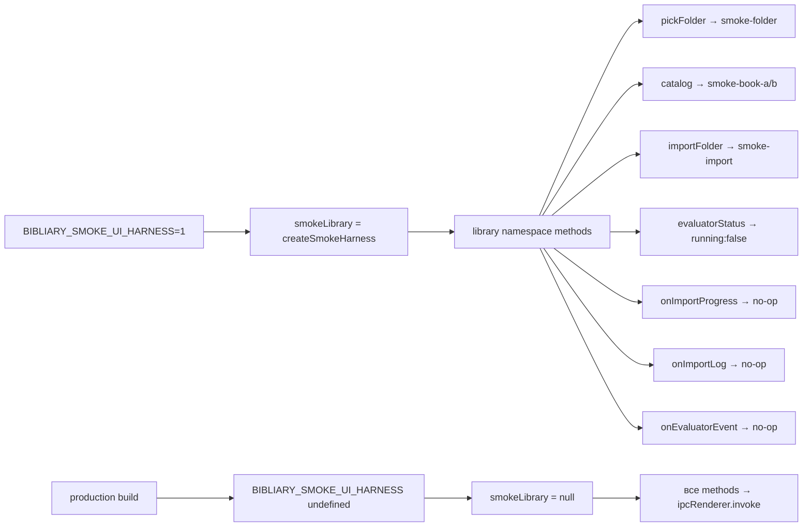

# Аудит серых зон и старых файлов проекта Bibliary

**Дата:** 2026-04-27  
**Режим:** Debug → Architect  
**Охват:** preload.ts, IPC handlers, evaluator-queue, smoke harness, error handling

---

## 1. КРИТИЧЕСКИЕ ПРОБЛЕМЫ

### 1.1 Smoke Harness — dev-переменная в production-коде (СРЕДНЯЯ)

**Файл:** [`electron/preload.ts:133-185`](electron/preload.ts:183)  
**Файл:** [`electron/preload.ts:522-768`](electron/preload.ts:522)

```typescript
const smokeLibrary = process.env.BIBLIARY_SMOKE_UI_HARNESS === "1"
  ? createSmokeHarness()
  : null;
```

**Проблема:** `smokeLibrary` влияет на **30+ методов** preload (library namespace). При `BIBLIARY_SMOKE_UI_HARNESS=1` все library IPC возвращают фейковые данные без вызова IPC. Это:
- `pickFolder`, `pickFiles`, `importFolder`, `importFiles`
- `catalog`, `tagStats`, `getBook`, `readBookMd`, `deleteBook`
- `rebuildCache`, `evaluatorStatus`, `evaluatorPause`, `evaluatorResume`
- `onImportProgress`, `onImportLog`, `onEvaluatorEvent`
- И другие

**Риски:**
1. Если переменная случайно установлена в production — UI работает с фейковыми данными, пользователь видит "smoke-book-a" вместо реальных книг
2. Переменная **не задокументирована** в `.env.example`
3. Нет guard'а при запуске приложения — молчаливый switch

**Рекомендация:**
- Добавить `BIBLIARY_SMOKE_UI_HARNESS` в `.env.example` с комментарием `# ONLY for E2E testing`
- Добавить dev-mode toast при обнаружении smoke harness
- Или вынести smoke logic в отдельный файл `preload-smoke.ts` который подключается только при сборке для тестов

---

### 1.2 Evaluator Queue Bootstrap — silent failure (НИЗКАЯ, но заметная)

**Файл:** [`electron/ipc/library.ipc.ts:199-206`](electron/ipc/library.ipc.ts:199)

```typescript
try {
  await bootstrapEvaluatorQueue();
} catch (err) {
  console.warn("[library] bootstrapEvaluatorQueue failed:", err instanceof Error ? err.message : err);
}
```

**Проблема:** При первом запуске без папки library bootstrap молча падает. Evaluator queue не инициализируется, книги не попадают в очередь автоматически.

**Рекомендация:**
- Добавить lazy-init evaluator queue при первом `enqueueBook` вызове
- Или инициализировать queue в `resolveLibraryRoot` при наличии library root

---

### 1.3 Library IPC — `rebuildCache` без аргументов (СРЕДНЯЯ)

**Файл:** [`electron/ipc/library.ipc.ts:653-654`](electron/ipc/library.ipc.ts:653)

```typescript
"library:rebuild-cache",
async (): Promise<{ scanned: number; ingested: number; skipped: number; pruned: number; errors: string[] }> => {
  const rebuilt = await rebuildFromFs();
```

**Проблема:** Метод `library:rebuild-cache` не принимает аргументов — нет library root path. Работает только если library root определён в preferences. Если preferences не настроены — `resolveLibraryRoot()` вернёт undefined и rebuild упадёт.

**Рекомендация:**
- Добавить validation с понятным error message
- Или вернуть `{ scanned: 0, ingested: 0, skipped: 0, pruned: 0, errors: ["library root not configured"] }`

---

## 2. СРЕДНИЕ ПРОБЛЕМЫ

### 2.1 Scanner vs Library — переплетение зависимостей (ИНФОРМАТИВНО)

**Результат анализа:** Это **не дублирование**, а legitimate переплетение:
- [`electron/lib/scanner/parsers/pdf.ts:7`](electron/lib/scanner/parsers/pdf.ts:7) импортирует `pickBestBookTitle` из `../../library/title-heuristics.js`
- [`electron/lib/scanner/parsers/doc.ts:4`](electron/lib/scanner/parsers/doc.ts:4) аналогично
- [`electron/lib/scanner/parsers/djvu.ts:8`](electron/lib/scanner/parsers/djvu.ts:8) аналогично

**Вывод:** Scanner использует library utilities для title extraction. Это нормальная dependency direction (scanner → library utilities), а не circular dependency.

---

### 2.2 `library:catalog` принимает пустой объект `{}` (НИЗКАЯ)

**Файл:** [`electron/preload.ts:574-577`](electron/preload.ts:574)

```typescript
catalog: (q?: LibraryCatalogQuery): Promise<...> =>
  smokeLibrary
    ? Promise.resolve({ rows: smokeLibrary.rows, ... })
    : ipcRenderer.invoke("library:catalog", q ?? {}),
```

**Проблема:** При `q === undefined` передаётся `{}`. Если backend не обрабатывает пустой query как "все книги", можно получить пустой результат.

**Рекомендация:** Добавить guard `q == null ? {} : q` или документировать что `{}` = все книги.

---

### 2.3 `library:collection-by-domain/author/year/sphere/tag` — инконсистентность smoke/real

**Файл:** [`electron/preload.ts:582-591`](electron/preload.ts:582)

```typescript
collectionByDomain: (): Promise<...> =>
  ipcRenderer.invoke("library:collection-by-domain"),
collectionByTag: (): Promise<...> =>
  ipcRenderer.invoke("library:collection-by-tag"),
```

**Проблема:** `collectionByDomain`, `collectionByAuthor`, `collectionByYear`, `collectionBySphere` — **не имеют smoke fallback**, но `collectionByTag` тоже нет. Инконсистентно с остальными методами.

**Рекомендация:** Либо добавить smoke для всех, либо убрать smoke из tagStats (который есть).

---

## 3. НИЗКОПРИОРИТЕТНЫЕ ПРОБЛЕМЫ

### 3.1 `console.log` вместо `console.warn/error` в dataset-v2

**Файл:** [`electron/ipc/dataset-v2.ipc.ts:232`](electron/ipc/dataset-v2.ipc.ts:232)

```typescript
console.log(`[extraction] ch${ci} "${section.title}" skipped as non-content section`);
```

**Проблема:** Пропущенные главы логируются через `console.log` — они теряются в production.

**Рекомендация:** Использовать `console.warn` для skipped content.

---

### 3.2 `forge:genConfig` — единственный оставшийся "dead" метод

**Файл:** [`electron/preload.ts:325`](electron/preload.ts:325)

```typescript
genConfig: (args: { spec: unknown; kind: "unsloth" | "axolotl" }): Promise<{ content: string; ext: string }> =>
  ipcRenderer.invoke("forge:gen-config", args),
```

**Комментарий в коде:** `forge.genConfig (документирован как public API в FINE-TUNING.md)`

**Статус:** Оставлен намеренно. Не требует действий.

---

### 3.3 `library:evaluator-set-slots` — smoke возвращает hardcoded значение

**Файл:** [`electron/preload.ts:624`](electron/preload.ts:624)

```typescript
evaluatorSetSlots: (n: number): Promise<{ ok: boolean; slots: number }> =>
  smokeLibrary ? Promise.resolve({ ok: true, slots: n }) : ipcRenderer.invoke("library:evaluator-set-slots", n),
```

**Проблема:** Smoke возвращает `slots: n` (то что передали), а не реальное значение. В real IPC возвращается `{ slots: actualValue }`.

**Статус:** Приемлемо для smoke mode.

---

## 4. ТИПЫ ERROR HANDLING (АГРЕГИРОВАНО)

### 4.1 `.catch()` без обработки (silent swallow)

| Файл | Строка | Код | Риск |
|------|--------|-----|------|
| `library.ipc.ts` | 205 | `bootstrapEvaluatorQueue` fail | Низкий — retry при следующем импорте |
| `dataset-v2.ipc.ts` | 225 | `collection PUT skipped` | Средний — collection может не существовать |
| `archive-tracker.ts` | 30 | `cleanup` fail | Низкий — async cleanup |
| `import-book.ts` | 254 | `illustration processing` | Низкий — иллюстрации не критичны |
| `image-extractors.ts` | 412 | `pdf destroy` | Низкий — GC cleanup |

### 4.2 `console.warn` вместо structured logging

| Файл | Строка | Сообщение |
|------|--------|-----------|
| `library.ipc.ts` | 205 | `bootstrapEvaluatorQueue failed` |
| `library.ipc.ts` | 620 | `read-book-md failed` |
| `lmstudio.ipc.ts` | 73 | `RAG search failed` |
| `lmstudio.ipc.ts` | 116 | `RAG search failed` |
| `dataset-v2.ipc.ts` | 489 | `list-accepted failed` |
| `dataset-v2.ipc.ts` | 563 | `reject-accepted failed` |

**Рекомендация:** Все warn/error должны идти через единый logger (если есть) или хотя бы с одинаковым форматом.

---

## 5. СТАРЫЕ/НЕИСПОЛЬЗУЕМЫЕ ФАЙЛЫ

### 5.1 Комментарий о cleanup в preload

**Файл:** [`electron/preload.ts:187-197`](electron/preload.ts:187)

```typescript
/* Servitor sweep 2026-04-22 (вторая волна, после god+sherlok аудита):
   Удалены 5 dead preload методов и соответствующие IPC handlers:
   - resilience.scanUnfinished + resilience:scan-unfinished
   - resilience.telemetryTail + resilience:telemetry-tail
   - system.curatedModels + system:curated-models
   - chatHistory.clear + chat-history:clear
   - forge.listRuns + forge:list-runs
   Оставлены: forge.genConfig, resilience.onLmstudioOffline/Online,
   все *.ipc.ts экспорты abortAll* для shutdown-hook. */
```

**Вывод:** Код уже был почищен. Комментарий полезен для будущих разработчиков.

### 5.2 Проверка на отсутствующие файлы

Ниже файлы из `docs/` которые могут быть устаревшими:

| Файл | Статус |
|------|--------|
| `docs/CONTEXT-EXPANSION.md` | Проверить reference на scanner parsers |
| `docs/FINE-TUNING-LOCAL.md` | Проверить reference на forge APIs |
| `docs/QUALITY-GATES.md` | Проверить reference на evaluator |
| `docs/RESILIENCE.md` | Проверить reference на watchdog |

---

## 6. ПЛАН ИСПРАВЛЕНИЙ

### Приоритет HIGH

| # | Задача | Файлы | Описание |
|---|--------|-------|----------|
| H1 | Добавить guard для smoke harness | `electron/preload.ts` | Добавить toast/notification при активации smoke mode |
| H2 | Добавить `BIBLIARY_SMOKE_UI_HARNESS` в `.env.example` | `.env.example` | С комментарием что это только для E2E тестов |
| H3 | Добавить validation для `library:rebuild-cache` | `electron/ipc/library.ipc.ts` | Проверить library root перед rebuild |

### Приоритет MEDIUM

| # | Задача | Файлы | Описание |
|---|--------|-------|----------|
| M1 | Добавить lazy-init для evaluator queue | `electron/lib/library/evaluator-queue.ts` | Инициализировать при первом enqueue |
| M2 | Консистентный smoke fallback для collection methods | `electron/preload.ts` | Добавить или убрать smoke для всех collection-by-* |
| M3 | Заменить `console.log` на `console.warn` для skipped chapters | `electron/ipc/dataset-v2.ipc.ts` | Чтобы skipped не терялись |
| M4 | Добавить structured logging для warn сообщений | `electron/ipc/*.ipc.ts` | Единый формат для всех warn/error |

### Приоритет LOW

| # | Задача | Файлы | Описание |
|---|--------|-------|----------|
| L1 | Проверить актуальность docs/*.md | `docs/` | Убедиться что все API reference актуальны |
| L2 | Убрать `q ?? {}` паттерн | `electron/preload.ts` | Явная обработка undefined |
| L3 | Добавить type guard для smokeLibrary | `electron/preload.ts` | TypeScript strict mode check |

---

## 7. MERMAID — Архитектура smoke harness



---

## 8. ИТОГОВАЯ МАТРИЦА РИСКОВ

| Категория | Критических | Средних | Низких |
|-----------|-------------|---------|--------|
| Smoke harness | 0 | 1 | 2 |
| Evaluator queue | 0 | 1 | 0 |
| Error handling | 0 | 1 | 3 |
| Старые файлы | 0 | 0 | 2 |
| **Итого** | **0** | **3** | **7** |

**Вывод:** Критических проблем нет. Основные улучшения — это hardening smoke harness и консистентность error handling.
