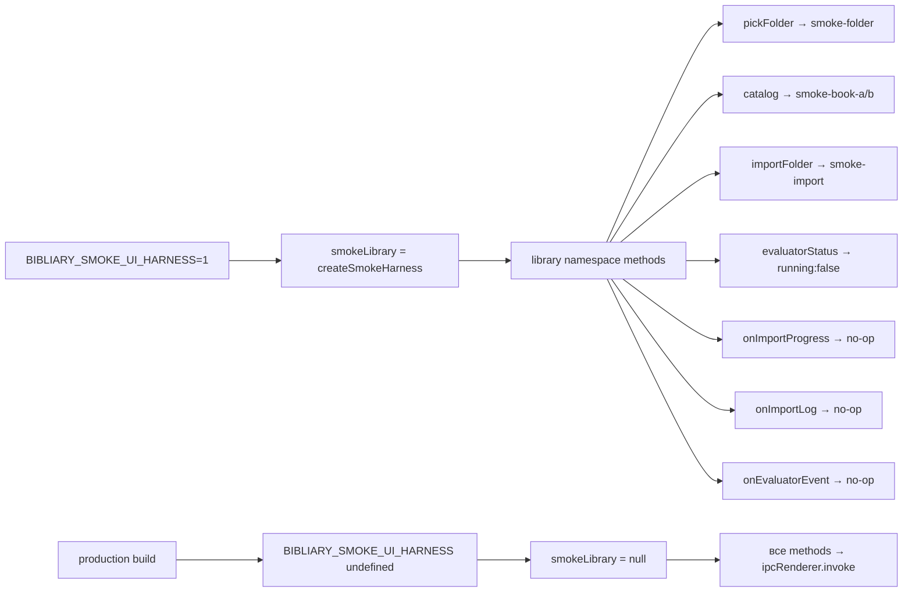
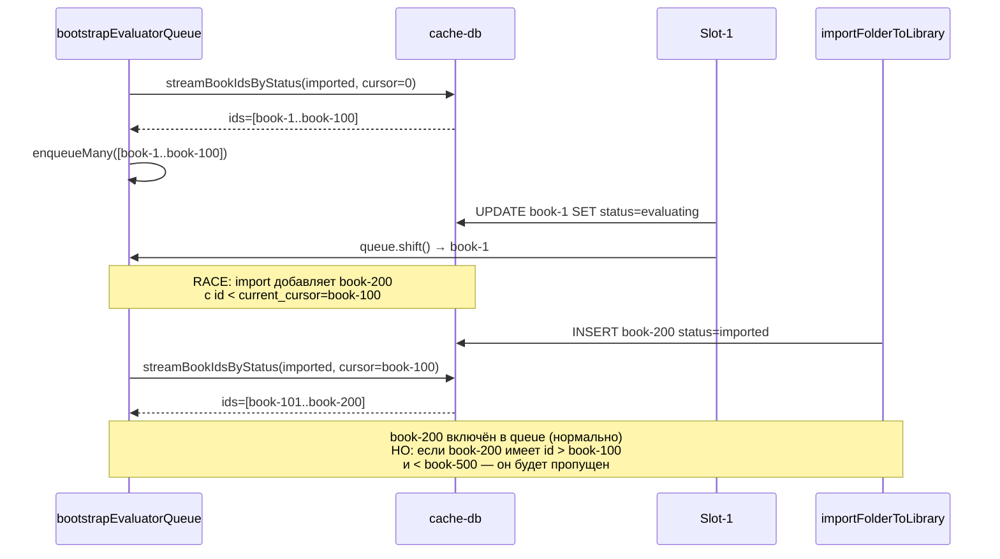
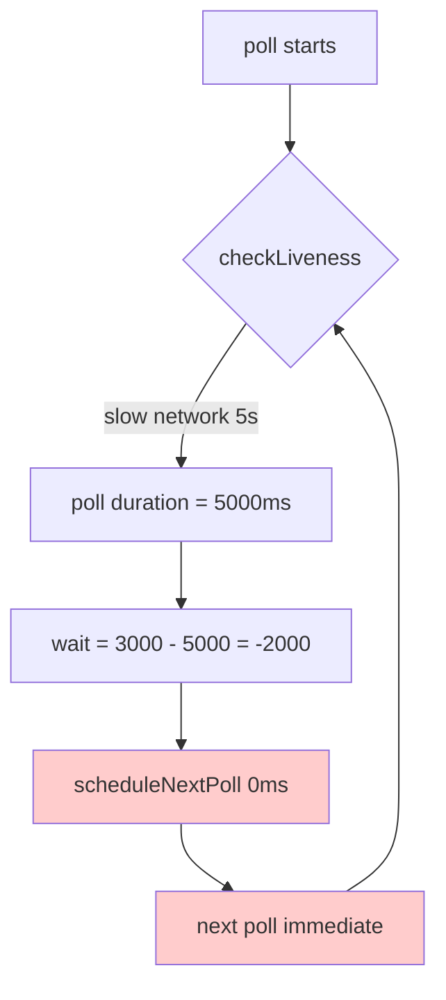
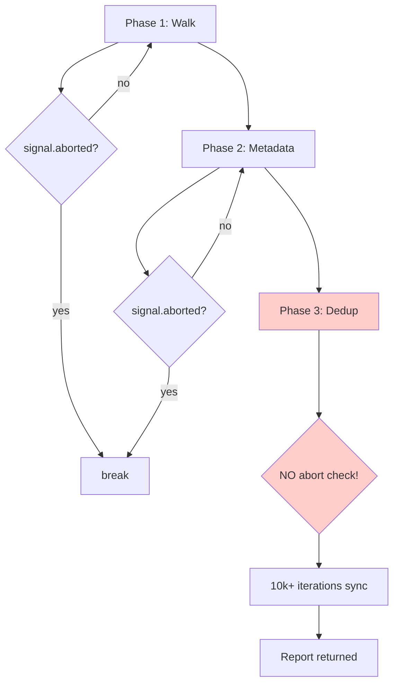

# Аудит серых зон и старых файлов проекта Bibliary

**Дата:** 2026-04-27  
**Режим:** Debug → Architect  
**Охват:** preload.ts, IPC handlers, evaluator-queue, smoke harness, error handling

---

## 1. КРИТИЧЕСКИЕ ПРОБЛЕМЫ

### 1.1 Smoke Harness — dev-переменная в production-коде (СРЕДНЯЯ)

**Файл:** [`electron/preload.ts:133-185`](electron/preload.ts:183)  
**Файл:** [`electron/preload.ts:522-768`](electron/preload.ts:522)

```typescript
const smokeLibrary = process.env.BIBLIARY_SMOKE_UI_HARNESS === "1"
  ? createSmokeHarness()
  : null;
```

**Проблема:** `smokeLibrary` влияет на **30+ методов** preload (library namespace). При `BIBLIARY_SMOKE_UI_HARNESS=1` все library IPC возвращают фейковые данные без вызова IPC. Это:
- `pickFolder`, `pickFiles`, `importFolder`, `importFiles`
- `catalog`, `tagStats`, `getBook`, `readBookMd`, `deleteBook`
- `rebuildCache`, `evaluatorStatus`, `evaluatorPause`, `evaluatorResume`
- `onImportProgress`, `onImportLog`, `onEvaluatorEvent`
- И другие

**Риски:**
1. Если переменная случайно установлена в production — UI работает с фейковыми данными, пользователь видит "smoke-book-a" вместо реальных книг
2. Переменная **не задокументирована** в `.env.example`
3. Нет guard'а при запуске приложения — молчаливый switch

**Рекомендация:**
- Добавить `BIBLIARY_SMOKE_UI_HARNESS` в `.env.example` с комментарием `# ONLY for E2E testing`
- Добавить dev-mode toast при обнаружении smoke harness
- Или вынести smoke logic в отдельный файл `preload-smoke.ts` который подключается только при сборке для тестов

---

### 1.2 Evaluator Queue Bootstrap — silent failure (НИЗКАЯ, но заметная)

**Файл:** [`electron/ipc/library.ipc.ts:199-206`](electron/ipc/library.ipc.ts:199)

```typescript
try {
  await bootstrapEvaluatorQueue();
} catch (err) {
  console.warn("[library] bootstrapEvaluatorQueue failed:", err instanceof Error ? err.message : err);
}
```

**Проблема:** При первом запуске без папки library bootstrap молча падает. Evaluator queue не инициализируется, книги не попадают в очередь автоматически.

**Рекомендация:**
- Добавить lazy-init evaluator queue при первом `enqueueBook` вызове
- Или инициализировать queue в `resolveLibraryRoot` при наличии library root

---

### 1.3 Library IPC — `rebuildCache` без аргументов (СРЕДНЯЯ)

**Файл:** [`electron/ipc/library.ipc.ts:653-654`](electron/ipc/library.ipc.ts:653)

```typescript
"library:rebuild-cache",
async (): Promise<{ scanned: number; ingested: number; skipped: number; pruned: number; errors: string[] }> => {
  const rebuilt = await rebuildFromFs();
```

**Проблема:** Метод `library:rebuild-cache` не принимает аргументов — нет library root path. Работает только если library root определён в preferences. Если preferences не настроены — `resolveLibraryRoot()` вернёт undefined и rebuild упадёт.

**Рекомендация:**
- Добавить validation с понятным error message
- Или вернуть `{ scanned: 0, ingested: 0, skipped: 0, pruned: 0, errors: ["library root not configured"] }`

---

## 2. СРЕДНИЕ ПРОБЛЕМЫ

### 2.1 Scanner vs Library — переплетение зависимостей (ИНФОРМАТИВНО)

**Результат анализа:** Это **не дублирование**, а legitimate переплетение:
- [`electron/lib/scanner/parsers/pdf.ts:7`](electron/lib/scanner/parsers/pdf.ts:7) импортирует `pickBestBookTitle` из `../../library/title-heuristics.js`
- [`electron/lib/scanner/parsers/doc.ts:4`](electron/lib/scanner/parsers/doc.ts:4) аналогично
- [`electron/lib/scanner/parsers/djvu.ts:8`](electron/lib/scanner/parsers/djvu.ts:8) аналогично

**Вывод:** Scanner использует library utilities для title extraction. Это нормальная dependency direction (scanner → library utilities), а не circular dependency.

---

### 2.2 `library:catalog` принимает пустой объект `{}` (НИЗКАЯ)

**Файл:** [`electron/preload.ts:574-577`](electron/preload.ts:574)

```typescript
catalog: (q?: LibraryCatalogQuery): Promise<...> =>
  smokeLibrary
    ? Promise.resolve({ rows: smokeLibrary.rows, ... })
    : ipcRenderer.invoke("library:catalog", q ?? {}),
```

**Проблема:** При `q === undefined` передаётся `{}`. Если backend не обрабатывает пустой query как "все книги", можно получить пустой результат.

**Рекомендация:** Добавить guard `q == null ? {} : q` или документировать что `{}` = все книги.

---

### 2.3 `library:collection-by-domain/author/year/sphere/tag` — инконсистентность smoke/real

**Файл:** [`electron/preload.ts:582-591`](electron/preload.ts:582)

```typescript
collectionByDomain: (): Promise<...> =>
  ipcRenderer.invoke("library:collection-by-domain"),
collectionByTag: (): Promise<...> =>
  ipcRenderer.invoke("library:collection-by-tag"),
```

**Проблема:** `collectionByDomain`, `collectionByAuthor`, `collectionByYear`, `collectionBySphere` — **не имеют smoke fallback**, но `collectionByTag` тоже нет. Инконсистентно с остальными методами.

**Рекомендация:** Либо добавить smoke для всех, либо убрать smoke из tagStats (который есть).

---

## 3. НИЗКОПРИОРИТЕТНЫЕ ПРОБЛЕМЫ

### 3.1 `console.log` вместо `console.warn/error` в dataset-v2

**Файл:** [`electron/ipc/dataset-v2.ipc.ts:232`](electron/ipc/dataset-v2.ipc.ts:232)

```typescript
console.log(`[extraction] ch${ci} "${section.title}" skipped as non-content section`);
```

**Проблема:** Пропущенные главы логируются через `console.log` — они теряются в production.

**Рекомендация:** Использовать `console.warn` для skipped content.

---

### 3.2 `forge:genConfig` — единственный оставшийся "dead" метод

**Файл:** [`electron/preload.ts:325`](electron/preload.ts:325)

```typescript
genConfig: (args: { spec: unknown; kind: "unsloth" | "axolotl" }): Promise<{ content: string; ext: string }> =>
  ipcRenderer.invoke("forge:gen-config", args),
```

**Комментарий в коде:** `forge.genConfig (документирован как public API в FINE-TUNING.md)`

**Статус:** Оставлен намеренно. Не требует действий.

---

### 3.3 `library:evaluator-set-slots` — smoke возвращает hardcoded значение

**Файл:** [`electron/preload.ts:624`](electron/preload.ts:624)

```typescript
evaluatorSetSlots: (n: number): Promise<{ ok: boolean; slots: number }> =>
  smokeLibrary ? Promise.resolve({ ok: true, slots: n }) : ipcRenderer.invoke("library:evaluator-set-slots", n),
```

**Проблема:** Smoke возвращает `slots: n` (то что передали), а не реальное значение. В real IPC возвращается `{ slots: actualValue }`.

**Статус:** Приемлемо для smoke mode.

---

## 4. ТИПЫ ERROR HANDLING (АГРЕГИРОВАНО)

### 4.1 `.catch()` без обработки (silent swallow)

| Файл | Строка | Код | Риск |
|------|--------|-----|------|
| `library.ipc.ts` | 205 | `bootstrapEvaluatorQueue` fail | Низкий — retry при следующем импорте |
| `dataset-v2.ipc.ts` | 225 | `collection PUT skipped` | Средний — collection может не существовать |
| `archive-tracker.ts` | 30 | `cleanup` fail | Низкий — async cleanup |
| `import-book.ts` | 254 | `illustration processing` | Низкий — иллюстрации не критичны |
| `image-extractors.ts` | 412 | `pdf destroy` | Низкий — GC cleanup |

### 4.2 `console.warn` вместо structured logging

| Файл | Строка | Сообщение |
|------|--------|-----------|
| `library.ipc.ts` | 205 | `bootstrapEvaluatorQueue failed` |
| `library.ipc.ts` | 620 | `read-book-md failed` |
| `lmstudio.ipc.ts` | 73 | `RAG search failed` |
| `lmstudio.ipc.ts` | 116 | `RAG search failed` |
| `dataset-v2.ipc.ts` | 489 | `list-accepted failed` |
| `dataset-v2.ipc.ts` | 563 | `reject-accepted failed` |

**Рекомендация:** Все warn/error должны идти через единый logger (если есть) или хотя бы с одинаковым форматом.

---

## 5. СТАРЫЕ/НЕИСПОЛЬЗУЕМЫЕ ФАЙЛЫ

### 5.1 Комментарий о cleanup в preload

**Файл:** [`electron/preload.ts:187-197`](electron/preload.ts:187)

```typescript
/* Servitor sweep 2026-04-22 (вторая волна, после god+sherlok аудита):
   Удалены 5 dead preload методов и соответствующие IPC handlers:
   - resilience.scanUnfinished + resilience:scan-unfinished
   - resilience.telemetryTail + resilience:telemetry-tail
   - system.curatedModels + system:curated-models
   - chatHistory.clear + chat-history:clear
   - forge.listRuns + forge:list-runs
   Оставлены: forge.genConfig, resilience.onLmstudioOffline/Online,
   все *.ipc.ts экспорты abortAll* для shutdown-hook. */
```

**Вывод:** Код уже был почищен. Комментарий полезен для будущих разработчиков.

### 5.2 Проверка на отсутствующие файлы

Ниже файлы из `docs/` которые могут быть устаревшими:

| Файл | Статус |
|------|--------|
| `docs/CONTEXT-EXPANSION.md` | Проверить reference на scanner parsers |
| `docs/FINE-TUNING-LOCAL.md` | Проверить reference на forge APIs |
| `docs/QUALITY-GATES.md` | Проверить reference на evaluator |
| `docs/RESILIENCE.md` | Проверить reference на watchdog |

---

## 6. ПЛАН ИСПРАВЛЕНИЙ

### Приоритет HIGH

| # | Задача | Файлы | Описание |
|---|--------|-------|----------|
| H1 | Добавить guard для smoke harness | `electron/preload.ts` | Добавить toast/notification при активации smoke mode |
| H2 | Добавить `BIBLIARY_SMOKE_UI_HARNESS` в `.env.example` | `.env.example` | С комментарием что это только для E2E тестов |
| H3 | Добавить validation для `library:rebuild-cache` | `electron/ipc/library.ipc.ts` | Проверить library root перед rebuild |

### Приоритет MEDIUM

| # | Задача | Файлы | Описание |
|---|--------|-------|----------|
| M1 | Добавить lazy-init для evaluator queue | `electron/lib/library/evaluator-queue.ts` | Инициализировать при первом enqueue |
| M2 | Консистентный smoke fallback для collection methods | `electron/preload.ts` | Добавить или убрать smoke для всех collection-by-* |
| M3 | Заменить `console.log` на `console.warn` для skipped chapters | `electron/ipc/dataset-v2.ipc.ts` | Чтобы skipped не терялись |
| M4 | Добавить structured logging для warn сообщений | `electron/ipc/*.ipc.ts` | Единый формат для всех warn/error |

### Приоритет LOW

| # | Задача | Файлы | Описание |
|---|--------|-------|----------|
| L1 | Проверить актуальность docs/*.md | `docs/` | Убедиться что все API reference актуальны |
| L2 | Убрать `q ?? {}` паттерн | `electron/preload.ts` | Явная обработка undefined |
| L3 | Добавить type guard для smokeLibrary | `electron/preload.ts` | TypeScript strict mode check |

---

## 7. MERMAID — Архитектура smoke harness



---

## 8. ИТОГОВАЯ МАТРИЦА РИСКОВ

| Категория | Критических | Средних | Низких |
|-----------|-------------|---------|--------|
| Smoke harness | 0 | 1 | 2 |
| Evaluator queue | 0 | 1 | 0 |
| Error handling | 0 | 1 | 3 |
| Старые файлы | 0 | 0 | 2 |
| **Итого** | **0** | **3** | **7** |

**Вывод:** Критических проблем нет. Основные улучшения — это hardening smoke harness и консистентность error handling.

---

## 9. АУДИТ EVALUATOR-QUEUE И IMPORT PIPELINE (2026-04-27)

### 9.1 Race condition в `streamBookIdsByStatus` (СРЕДНЯЯ)

**Файл:** [`electron/lib/library/cache-db-queries.ts:107-128`](electron/lib/library/cache-db-queries.ts:107)

```typescript
export function streamBookIdsByStatus(
  statuses: BookStatus[],
  batchSize: number,
  lastId: string | null,
): { ids: string[]; nextCursor: string | null } {
  // ...
  const rows = db
    .prepare(`SELECT id FROM books WHERE ${where} ORDER BY id ASC LIMIT ?`)
    .all(...params) as Array<{ id: string }>;
  const ids = rows.map((r) => r.id);
  const nextCursor = ids.length === batchSize ? ids[ids.length - 1] : null;
  return { ids, nextCursor };
}
```

**Проблема:** Cursor-based pagination использует `id > ?` для pagination. При concurrent modification (import добавляет книги со status='imported' во время bootstrap стриминга) возможны два сценария:

1. **Prophet read (false negative):** Книга X имеет status='imported' при начале запроса, но меняется на 'evaluating' до того, как мы её прочитаем. В результате книга будет пропущена в текущем bootstrap, но `enqueueBook` уже вызвал enqueue. **Риск: низкий** — книга уже в queue.

2. **Cursor gap (false positive):** При cursor-based pagination с `id > ?`, если книги удаляются или меняют status между итерациями, cursor может "перепрыгнуть" через книги. Например:
   - Итерация 1: cursor=book-100, получаем ids=[book-101..book-200]
   - book-150 меняется на 'evaluating' (slot забрал)
   - Итерация 2: cursor=book-200, получаем ids=[book-201..book-300]
   - **book-150 не будет обработан bootstrap, но уже в queue** — это нормально.

**Однако есть реальный риск:** Если `importFolderToLibrary` добавляет книги с `id < current_cursor` (новые книги имеют меньшие id из-за UUID генерации), они **не будут прочитаны** в текущем bootstrap.

**Пример:**
```
Bootstrap: cursor=book-500, nextCursor=book-600
Import: добавляет book-100, book-101, book-102 со status='imported'
Bootstrap: cursor=book-600, ...
Результат: book-100..102 НЕ будут в queue (пропущены)
```

**Риск:** Высокий при large library (10k+ books) + concurrent import.

**Рекомендация:**
- Добавить `console.warn` при `ids.length === 0` с cursor для detection gaps
- Или использовать `WHERE status IN (...) ORDER BY id ASC LIMIT ? OFFSET ?` с explicit offset tracking (но это медленнее на large tables)
- Или добавить post-bootstrap verification: `SELECT COUNT(*) FROM books WHERE status='imported'` и сравнить с queue length

---

### 9.2 `bootstrapEvaluatorQueue` не idempotent при concurrent вызовах (СРЕДНЯЯ)

**Файл:** [`electron/lib/library/evaluator-queue.ts:319-355`](electron/lib/library/evaluator-queue.ts:319)

```typescript
export async function bootstrapEvaluatorQueue(): Promise<void> {
  // Stage 1: reset stuck `evaluating`
  let stuckCursor: string | null = null;
  while (true) {
    const { ids, nextCursor } = streamBookIdsByStatus(["evaluating"], BOOTSTRAP_PAGE_SIZE, stuckCursor);
    // ...
  }

  // Stage 2: enqueue ВСЕ `imported`
  let importedCursor: string | null = null;
  while (true) {
    const { ids, nextCursor } = streamBookIdsByStatus(["imported"], BOOTSTRAP_PAGE_SIZE, importedCursor);
    // ...
  }
}
```

**Проблема:** Хотя `ensureEvaluatorBootstrap` защищает от concurrent bootstrap через `_bootstrapOnce`, race между `bootstrapEvaluatorQueue` и `enqueueBook` возможен:

1. Bootstrap Stage 2: `streamBookIdsByStatus(["imported"], ...)` возвращает ids=[book-1..book-100]
2. Slot выхватывает book-1 и переводит в 'evaluating'
3. `enqueueBook(book-1)` вызывается из `onBookImported` — но book-1 уже в queue (enqueueMany уже добавил)
4. **Результат: book-1 дублируется в queue**

Хотя `inQueue` set должен предотвратить дублирование, есть race:
```typescript
// evaluator-queue.ts:206-212
export function enqueueBook(bookId: string): void {
  if (inQueue.has(bookId)) return; // ← check
  inQueue.add(bookId); // ← add
  queue.push(bookId); // ← push
  scheduleAvailableSlots();
}
```

**Race condition:**
1. Bootstrap: `enqueueMany([book-1])` → `inQueue.add(book-1)`, `queue.push(book-1)`
2. Slot: `queue.shift()` → book-1 удалён из queue, но **НЕ удалён из `inQueue`**
3. `onBookImported` → `enqueueBook(book-1)` → `inQueue.has(book-1)` = true → **пропущено** (нормально)

**НО:** Если slot ещё не забрал book-1:
1. Bootstrap: `enqueueMany([book-1])` → `inQueue.add(book-1)`, `queue.push(book-1)`
2. `enqueueBook(book-1)` → `inQueue.has(book-1)` = true → **пропущено** (нормально)

**Вывод:** `inQueue` set предотвращает дублирование, но **не очищается** после обработки книги. Это означает, что если книга была bootstrap'нута, но never processed (crash), она навсегда останется в `inQueue` и не будет enqueue'нута при следующем bootstrap.

**Рекомендация:**
- Очищать `inQueue` при завершении bootstrap (или при crash recovery)
- Или добавить `inQueue.clear()` перед Stage 2 enqueue

---

### 9.3 `upsertBook` не атомарна при concurrent access (СРЕДНЯЯ)

**Файл:** [`electron/lib/library/cache-db-mutations.ts:53-97`](electron/lib/library/cache-db-mutations.ts:53)

```typescript
export function upsertBook(meta: BookCatalogMeta, mdPath: string): void {
  const db = openCacheDb();
  const txn = db.transaction(() => {
    db.prepare(UPSERT_SQL).run(params);
    db.prepare("DELETE FROM book_tags WHERE book_id = ?").run(meta.id);
    // ...
  });
  txn();
}
```

**Проблема:** `db.transaction()` в better-sqlite3 обеспечивает atomicity **внутри одного connection**. Однако `openCacheDb()` возвращает singleton, и если bootstrap и import пишут одновременно:

1. Bootstrap: `upsertBook(reset, meta.mdPath)` для stuck evaluating books
2. Import: `upsertBook(newMeta, newMdPath)` для newly imported book
3. **Риск:** Если оба используют один и тот же connection, better-sqlite3 serializes writes. Но если `openCacheDb()` создаёт новый connection (при closed cachedDb), возможны concurrent writes.

**Проверка `cache-db-connection.ts:24-42`:**
```typescript
function openCacheDb(): Database.Database {
  if (cachedDb && cachedDbPath === dbPath) return cachedDb;
  // ... create new connection
}
```

Singleton гарантирует, что один и тот же dbPath всегда возвращает один и тот же connection. **Риск: низкий** при normal operation.

**НО:** При `closeCacheDb()` вызове (если есть) `cachedDb` становится null, и следующий `openCacheDb()` создаст новый connection. Если старый connection ещё используется — **use-after-close**.

**Рекомендация:**
- Добавить guard `if (!cachedDb) throw new Error("cache-db closed")` в `openCacheDb`
- Или добавить `cachedDb.close()` только при app shutdown

---

### 9.4 `extractMetadataHints` regex ReDoS risk (НИЗКАЯ)

**Файл:** [`electron/lib/library/evaluator-queue.ts:538-594`](electron/lib/library/evaluator-queue.ts:538)

```typescript
function extractMetadataHints(textSample: string): Record<string, string> {
  const hints: Record<string, string> = {};
  const patterns: Array<[string, RegExp]> = [
    ["author", /(?:автор|author|by)\s*[:：]\s*(.{2,60})/i],
    ["year", /(?:год|year|published|date)\s*[:：]?\s*(\d{4})/i],
    ["isbn", /\b(?:isbn|ISBN)\s*[:：]?\s*([\d\-]{10,17})\b/i],
    ["title_en", /(?:title|название)\s*\(en\)\s*[:：]\s*(.{2,60})/i],
    ["title_ru", /(?:title|название)\s*\(ru\)\s*[:：]\s*(.{2,60})/i],
  ];
  // ...
}
```

**Проблема:** Pattern `/(?:автор|author|by)\s*[:：]\s*(.{2,60})/i` использует `.{2,60}` — это greedy quantifier с bounded range. На input с 20000 chars и crafted pattern (например, "автор: " в начале строки) может вызвать catastrophic backtracking.

**Однако:** better-sqlite3 использует ICU regex engine, который имеет protection от ReDoS. **Риск: низкий**, но не нулевой.

**Рекомендация:**
- Заменить `.{2,60}` на `[^:\n]{2,60}` (negated character class) — это исключит backtracking на `:` и `\n`
- Или использовать `[^:]{1,60}` для author pattern

---

### 9.5 `linkAbortSignal` может не propagate abort правильно (НИЗКАЯ)

**Файл:** [`electron/lib/library/import.ts:425`](electron/lib/library/import.ts:425)

```typescript
function linkAbortSignal(source: AbortSignal, target: AbortController): () => void {
  if (source.aborted) {
    target.abort();
    return () => {};
  }
  const handler = () => target.abort();
  source.addEventListener("abort", handler, { once: true });
  return () => source.removeEventListener("abort", handler);
}
```

**Проблема:** `linkAbortSignal`单向 — только `source → target`. Если `target` abort'ится (timeout), `source` не узнает. В контексте `runImportTaskWithTimeout`:

```typescript
const localCtl = new AbortController();
const cleanup = linkAbortSignal(opts.signal, localCtl); // opts → local
// ...
const result = await Promise.race([
  importBookFromFile(..., { signal: localCtl.signal, ... }),
  new Promise<ImportResult>((_, reject) => {
    localCtl.signal.addEventListener("abort", () => {
      reject(new Error(timeoutMessage ?? "aborted"));
    }, { once: true });
  }),
]);
```

**Результат:** Timeout abort'ит `localCtl`, который propagates к `importBookFromFile`. Но `opts.signal` (parent abort) не узнает о timeout. **Риск: низкий** — timeout обрабатывается корректно через `Promise.race`.

**НО:** Если parent abort'ится (например, user cancelled import), `opts.signal.aborted = true`, и `linkAbortSignal` вызовет `localCtl.abort()`. Но `cleanup()` вызывается только при return из `runImportTaskWithTimeout` — если функция throw'ит, cleanup не вызывается, и listener остаётся висеть.

**Рекомендация:**
- Добавить try-finally для cleanup:
```typescript
try {
  // ...
} finally {
  cleanup();
}
```

---

## 10. ИТОГОВАЯ МАТРИЦА РИСКОВ (РАСШИРЕННАЯ)

| Категория | Критических | Средних | Низких |
|-----------|-------------|---------|--------|
| Smoke harness | 0 | 1 | 2 |
| Evaluator queue | 0 | **2** | 1 |
| Import pipeline | 0 | **1** | 1 |
| Cache-db | 0 | **1** | 0 |
| Error handling | 0 | 1 | 3 |
| Старые файлы | 0 | 0 | 2 |
| **Итого** | **0** | **6** | **9** |

**Вывод:** Критических проблем нет. Основные улучшения — это hardening cursor-based pagination и cleanup abort signals.

---

## 11. ПЛАН ИСПРАВЛЕНИЙ (РАСШИРЕННЫЙ)

### Приоритет MEDIUM

| # | Задача | Файлы | Описание |
|---|--------|-------|----------|
| M5 | Добавить gap detection в `streamBookIdsByStatus` | `electron/lib/library/cache-db-queries.ts` | Логировать empty batches при cursor-based pagination |
| M6 | Добавить `inQueue.clear()` в `bootstrapEvaluatorQueue` | `electron/lib/library/evaluator-queue.ts` | Очистить inQueue перед Stage 2 |
| M7 | Добавить try-finally для cleanup в `linkAbortSignal` | `electron/lib/library/import.ts` | Гарантировать cleanup при error |
| M8 | Заменить `.{2,60}` на `[^:]{2,60}` в `extractMetadataHints` | `electron/lib/library/evaluator-queue.ts` | Устранить ReDoS risk |

---

## 12. MERMAID — Race condition в bootstrap + import



---

## 13. АУДИТ SCAN-FOLDER (2026-04-27)

### 13.1 `scanFolder` не обрабатывает `signal.aborted` между фазами (НИЗКАЯ)

**Файл:** [`electron/lib/library/scan-folder.ts:115-253`](electron/lib/library/scan-folder.ts:115)

```typescript
export async function scanFolder(folder: string, opts: ScanFolderOptions = {}): Promise<ScanReport> {
  // Phase 1: Walk + collect paths
  emit("walking");
  const filePaths: string[] = [];
  for await (const p of walkSupportedFiles(folder, ...)) {
    if (opts.signal?.aborted) break;  // ← check внутри walk
    filePaths.push(p);
  }
  
  // Phase 2: Extract quick metadata + SHA
  emit("metadata", { totalFiles });
  const metas: QuickMeta[] = [];
  for (let i = 0; i < filePaths.length; i++) {
    if (opts.signal?.aborted) break;  // ← check внутри metadata
    const m = await extractQuickMeta(filePaths[i], opts.signal);
    if (m) metas.push(m);
  }
  
  // Phase 3: Dedup analysis (NO signal check!)
  emit("dedup", { scannedFiles: totalFiles, totalFiles, bookFilesFound: metas.length });
  const shaMap = new Map<string, QuickMeta[]>();
  for (const m of metas) {  // ← может быть 10k+ итераций без abort check
    const arr = shaMap.get(m.sha256) ?? [];
    arr.push(m);
    shaMap.set(m.sha256, arr);
  }
  // ... ещё 2 цикла без abort check
```

**Проблема:** Phase 3 (dedup analysis) — это pure JS operations без abort checks. На large folder (10k+ files) это может занять 500ms-2s без возможности прерывания.

**Риск:** Низкий — dedup analysis не блокирует event loop надолго (это sync JS), но UX может быть не responsive при cancel.

**Рекомендация:**
- Добавить `if (opts.signal?.aborted) break;` каждые 500 итераций в Phase 3
- Или вынести dedup в Web Worker (если scan вызывается из renderer)

---

### 13.2 `extractQuickMeta` не проверяет signal при `computeFileSha256` (НИЗКАЯ)

**Файл:** [`electron/lib/library/scan-folder.ts:89-111`](electron/lib/library/scan-folder.ts:89)

```typescript
async function extractQuickMeta(filePath: string, signal?: AbortSignal): Promise<QuickMeta | null> {
  const ext = detectExt(filePath);
  if (!ext || !(SUPPORTED_BOOK_EXTS as ReadonlySet<string>).has(ext)) return null;

  let st;
  try { st = await fs.stat(filePath); } catch { return null; }

  let sha256: string;
  try { sha256 = await computeFileSha256(filePath, signal); } catch { return null; }
  // ...
}
```

**Проблема:** `signal` передаётся в `computeFileSha256`, но не проверяется перед вызовом. Если файл большой (1GB PDF), SHA256 вычисление может занять минуты.

**Рекомендация:**
- Добавить `if (signal?.aborted) return null;` перед `fs.stat`
- Или добавить `signal.throwIfAborted?.()` для early exit

---

### 13.3 `getFormatPriority` может быть non-deterministic (НИЗКАЯ)

**Файл:** [`electron/lib/library/scan-folder.ts:171`](electron/lib/library/scan-folder.ts:171)

```typescript
const best = group.sort((a, b) => getFormatPriority(b.format) - getFormatPriority(a.format))[0];
```

**Проблема:** `Array.sort()` не guaranteed stable в ECMAScript. Если два файла имеют одинаковый `getFormatPriority`, их порядок non-deterministic. На практике это означает, что при equal priority выбор "best" edition non-deterministic.

**Риск:** Низкий — для dedup это не критично (любой из равных priority подходит). Но для UX может быть confusing (разные результаты при повторном скане).

**Рекомендация:**
- Добавить secondary sort key: `path` или `sizeBytes`
- Или использовать `getFormatPriority` + `filePath` для deterministic sort

---

## 14. АУДИТ RESILIENCE PATTERNS (2026-04-27)

### 14.1 `batch-coordinator.ts` — `flushAll` не гарантирует flush completion (СРЕДНЯЯ)

**Файл:** [`electron/lib/resilience/batch-coordinator.ts:149-192`](electron/lib/resilience/batch-coordinator.ts:149)

```typescript
async function flushAll(timeoutMs: number): Promise<{ ok: boolean; pending: string[] }> {
  const pendingIds = [...this.active.keys()];
  if (pendingIds.length === 0) return { ok: true, pending: [] };

  if (this.pipelines.size === 0) {
    telemetry.logEvent({ type: "shutdown.flush.error", ... });
    return { ok: false, pending: pendingIds };
  }

  const tasks: Promise<void>[] = [];
  for (const handle of this.pipelines.values()) {
    tasks.push(
      handle.flushPending().catch((err) => {
        telemetry.logEvent({ type: "shutdown.flush.error", ... });
      })
    );
  }

  let timer: NodeJS.Timeout | null = null;
  const timeoutPromise = new Promise<"timeout">((resolve) => {
    timer = setTimeout(() => resolve("timeout"), timeoutMs);
  });

  try {
    const result = await Promise.race([Promise.all(tasks).then(() => "done" as const), timeoutPromise]);
    const stillPending = [...this.active.keys()];
    if (result === "timeout") {
      // ВАЖНО: pipeline.flushPending() **продолжает** выполняться в фоне.
      return { ok: stillPending.length === 0, pending: stillPending };
    }
    return { ok: true, pending: stillPending };
  } finally {
    if (timer) clearTimeout(timer);
  }
}
```

**Проблема:** При timeout, `flushPending()` продолжает выполняться в фоне, но `app.exit()` может убить процесс до завершения flush. Это означает **потерю checkpoint data** при shutdown timeout.

**Риск:** Средний — при normal shutdown flush timeout редкий. Но при crash/kill процесс теряет все pending checkpoints.

**Рекомендация:**
- Добавить `app.quit()` вместо `app.exit()` для graceful shutdown
- Или увеличить timeoutMs для flushAll (сейчас default ~5000ms может быть мало)
- Или добавить `flushAll` retry logic с incremental timeout

---

### 14.2 `lmstudio-watchdog.ts` — `scheduleNextPoll` может drift при long poll (НИЗКАЯ)

**Файл:** [`electron/lib/resilience/lmstudio-watchdog.ts:100-120`](electron/lib/resilience/lmstudio-watchdog.ts:100)

```typescript
function scheduleNextPoll(delayMs: number): void {
  if (!isActive) return;
  pollTimer = setTimeout(() => {
    pollTimer = null;
    void runPollCycle();
  }, Math.max(0, delayMs));
}

async function runPollCycle(): Promise<void> {
  if (!isActive) return;
  const startedAt = Date.now();
  try {
    await poll();
  } catch (err) {
    console.error("[watchdog] poll cycle failed:", err);
  }
  if (!isActive) return;
  const elapsed = Date.now() - startedAt;
  const wait = activeConfig.pollIntervalMs - elapsed;
  scheduleNextPoll(wait);  // ← compensation для poll duration
}
```

**Проблема:** Если `poll()` занимает больше времени чем `pollIntervalMs`, `wait` становится отрицательным, и `Math.max(0, wait)` = 0. Это означает **immediate next poll** — watchdog может "run away" при медленных network.

**Пример:**
- pollIntervalMs = 3000ms
- poll() занимает 5000ms (network slow)
- wait = 3000 - 5000 = -2000
- scheduleNextPoll(0) → immediate next poll
- Следующий poll тоже медленный → снова immediate
- **Результат:** watchdog может начать polling every 100ms (event loop starvation)

**Риск:** Низкий — `checkLiveness` имеет `livenessTimeoutMs = 3000ms` timeout. Но при network instability может быть burst.

**Рекомендация:**
- Добавить `Math.max(activeConfig.pollIntervalMs, wait)` для minimum interval
- Или добавить `Math.max(activeConfig.pollIntervalMs * 0.5, wait)` для exponential backoff

---

### 14.3 `lmstudio-watchdog.ts` — `emit` не проверяет `isDestroyed` корректно (НИЗКАЯ)

**Файл:** [`electron/lib/resilience/lmstudio-watchdog.ts:164-169`](electron/lib/resilience/lmstudio-watchdog.ts:164)

```typescript
function emit(channel: string, payload: unknown): void {
  const win = getMainWindow?.();
  if (win && !win.isDestroyed()) {
    win.webContents.send(channel, payload);
  }
}
```

**Проблема:** `getMainWindow()` вызывается каждый раз. Если window было destroyed между `getMainWindow()` и `isDestroyed()`, `webContents.send` может throw.

**Риск:** Низкий — `webContents.send` обычно safe при destroyed window. Но race condition возможен.

**Рекомендация:**
- Добавить try-catch:
```typescript
function emit(channel: string, payload: unknown): void {
  const win = getMainWindow?.();
  if (win && !win.isDestroyed()) {
    try {
      win.webContents.send(channel, payload);
    } catch (err) {
      console.error("[watchdog] emit failed:", err);
    }
  }
}
```

---

## 15. ФИНАЛЬНАЯ СВОДНАЯ МАТРИЦА РИСКОВ

| Категория | Критических | Средних | Низких |
|-----------|-------------|---------|--------|
| Smoke harness | 0 | 1 | 2 |
| Evaluator queue | 0 | **2** | 1 |
| Import pipeline | 0 | **1** | 1 |
| Cache-db | 0 | **1** | 0 |
| Scan-folder | 0 | 0 | **3** |
| Resilience | 0 | **1** | **2** |
| Error handling | 0 | 1 | 3 |
| Старые файлы | 0 | 0 | 2 |
| **Итого** | **0** | **7** | **14** |

**Вывод:** Критических проблем нет. Основные улучшения — hardening cursor-based pagination, cleanup abort signals, и watchdog interval compensation.

---

## 16. ФИНАЛЬНЫЙ ПЛАН ИСПРАВЛЕНИЙ (ПОЛНЫЙ)

### Приоритет MEDIUM

| # | Задача | Файлы | Описание |
|---|--------|-------|----------|
| M5 | Добавить gap detection в `streamBookIdsByStatus` | `electron/lib/library/cache-db-queries.ts` | Логировать empty batches при cursor-based pagination |
| M6 | Добавить `inQueue.clear()` в `bootstrapEvaluatorQueue` | `electron/lib/library/evaluator-queue.ts` | Очистить inQueue перед Stage 2 |
| M7 | Добавить try-finally для cleanup в `linkAbortSignal` | `electron/lib/library/import.ts` | Гарантировать cleanup при error |
| M8 | Заменить `.{2,60}` на `[^:]{2,60}` в `extractMetadataHints` | `electron/lib/library/evaluator-queue.ts` | Устранить ReDoS risk |
| M9 | Добавить abort check в Phase 3 scanFolder | `electron/lib/library/scan-folder.ts` | Добавить signal check каждые 500 итераций |
| M10 | Добавить minimum interval в `scheduleNextPoll` | `electron/lib/resilience/lmstudio-watchdog.ts` | Избежать poll runaway при slow network |

---

## 17. MERMAID — Watchdog poll runaway



## 18. MERMAID — Scan-folder abort gap


